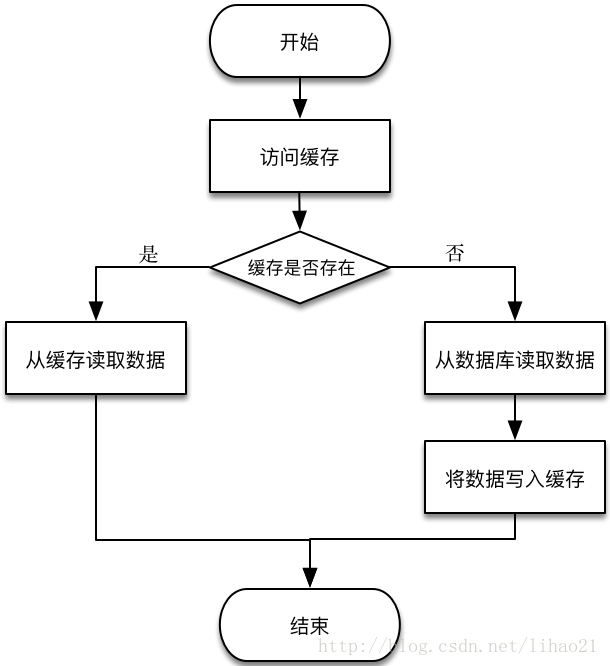
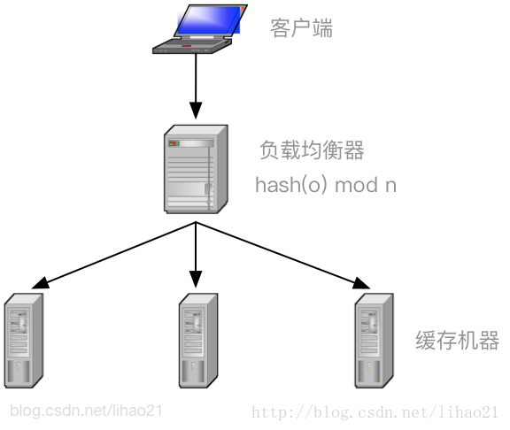
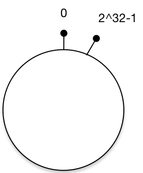
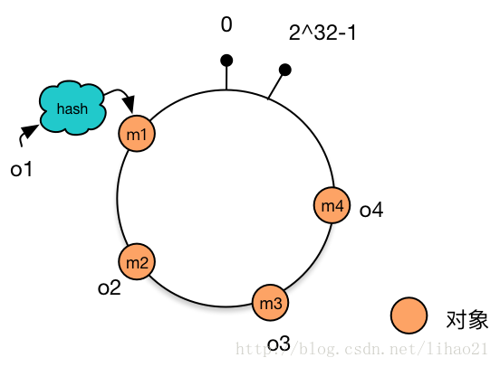
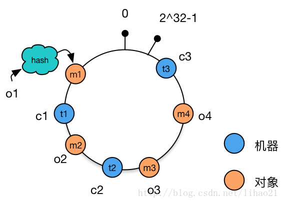
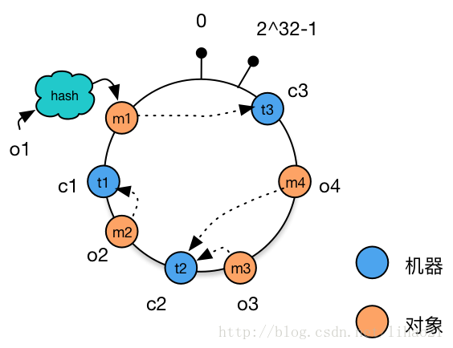
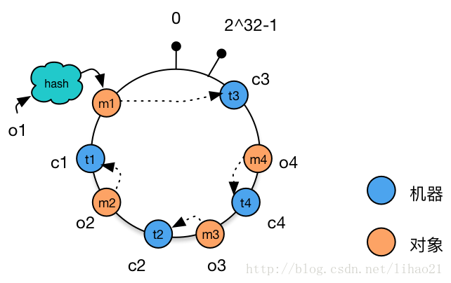
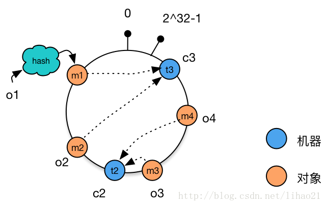
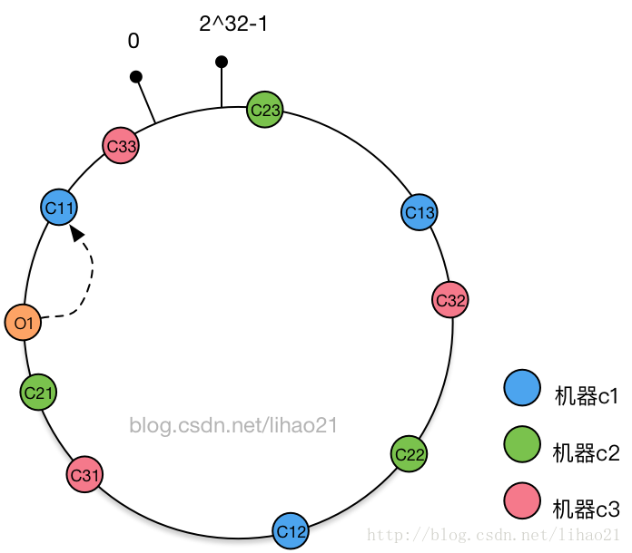
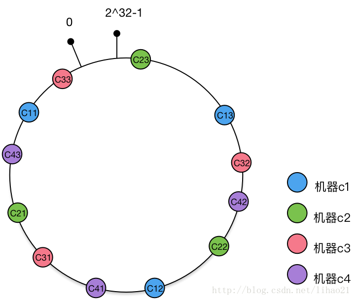

## 一致性hash环

### 引入

在业务开发中，我们常把数据持久化到数据库中。如果需要读取这些数据，除了直接从数据库中读取外，为了减轻数据库的访问压力以及提高访问速度，我们更多地引入缓存来对数据进行存取。读取数据的过程一般为：



这个时候就要通过分布式缓存，保证缓存服务的稳定性。对于分布式缓存，不同机器上存储不同对象的数据。为了实现这些缓存机器的负载均衡，可以使用式子1来定位对象缓存的存储机器：

```
m = hash(o) mod n ——式子1
```

其中，o为对象的名称，n为机器的数量，m为机器的编号，hash为一hash函数。图2中的负载均衡器（load balancer）正是使用式子1来将客户端对不同对象的请求分派到不同的机器上执行，例如，对于对象o，经过式子1的计算，得到m的值为3，那么所有对对象o的读取和存储的请求都被发往机器3执行。



式子1在大部分时候都可以工作得很好，然而，当机器需要扩容或者机器出现宕机的情况下，事情就比较棘手了。

当机器扩容，需要增加一台缓存机器时，负载均衡器使用的式子变成：

```
m = hash(o) mod (n + 1) ——式子2
```

当机器宕机，机器数量减少一台时，负载均衡器使用的式子变成：

```
m = hash(o) mod (n - 1) ——式子3
```

我们以机器扩容的情况为例，说明简单的取模方法会导致什么问题。假设机器由3台变成4台，对象o1由式子1计算得到的m值为2，由式子2计算得到的m值却可能为0，1，2，3（一个 3t + 2的整数对4取模，其值可能为0，1，2，3，读者可以自行验证），大约有75%（3/4)的可能性出现缓存访问不命中的现象。随着机器集群规模的扩大，这个比例线性上升。当99台机器再加入1台机器时，不命中的概率是99%（99/100）。这样的结果显然是不能接受的，因为这会导致数据库访问的压力陡增，严重情况，还可能导致数据库宕机。

一致性hash算法正是为了解决此类问题的方法，它可以保证当机器增加或者减少时，对缓存访问命中的概率影响减至很小。下面我们来详细说一下一致性hash算法的具体过程。

### 一致性Hash环

一致性hash算法通过一个叫作一致性hash环的数据结构实现。这个环的起点是0，终点是2^32 - 1，并且起点与终点连接，环的中间的整数按逆时针分布，故这个环的整数分布范围是[0, 2^32-1]，如下图3所示：



### 将对象放置到Hash环

假设现在我们有4个对象，分别为o1，o2，o3，o4，使用hash函数计算这4个对象的hash值（范围为0 ~ 2^32-1）:

```
hash(o1) = m1
hash(o2) = m2
hash(o3) = m3
hash(o4) = m4
```

把m1，m2，m3，m4这4个值放置到hash环上，得到如下图4：



### 将机器放置到Hash环

使用同样的hash函数，我们将机器也放置到hash环上。假设我们有三台缓存机器，分别为 c1，c2，c3，使用hash函数计算这3台机器的hash值：

```
hash(c1) = t1
hash(c2) = t2
hash(c3) = t3
```

把t1，t2，t3 这3个值放置到hash环上，得到如下图5：



### 为对象选择机器

将对象和机器都放置到同一个hash环后，在hash环上顺时针查找距离这个对象的hash值最近的机器，即是这个对象所属的机器。

例如，对于对象o2，顺序针找到最近的机器是c1，故机器c1会缓存对象o2。而机器c2则缓存o3，o4，机器c3则缓存对象o1。



### 处理机器增减的情况

对于线上的业务，增加或者减少一台机器的部署是常有的事情。

例如，增加机器c4的部署并将机器c4加入到hash环的机器c3与c2之间。这时，只有机器c3与c4之间的对象需要重新分配新的机器。对于我们的例子，只有对象o4被重新分配到了c4，其他对象仍在原有机器上。如图7所示：



如上文前面所述，使用简单的求模方法，当新添加机器后会导致大部分缓存失效的情况，使用一致性hash算法后这种情况则会得到大大的改善。前面提到3台机器变成4台机器后，缓存命中率只有25%（不命中率75%）。而使用一致性hash算法，理想情况下缓存命中率则有75%，而且，随着机器规模的增加，命中率会进一步提高，99台机器增加一台后，命中率达到99%，这大大减轻了增加缓存机器带来的数据库访问的压力。

再例如，将机器c1下线（当然，也有可能是机器c1宕机），这时，只有原有被分配到机器c1对象需要被重新分配到新的机器。对于我们的例子，只有对象o2被重新分配到机器c3，其他对象仍在原有机器上。如图8所示



### 虚拟节点

上面提到的过程基本上就是一致性hash的基本原理了，不过还有一个小小的问题。新加入的机器c4只分担了机器c2的负载，机器c1与c3的负载并没有因为机器c4的加入而减少负载压力。如果4台机器的性能是一样的，那么这种结果并不是我们想要的。

为此，我们引入虚拟节点来解决负载不均衡的问题。

将每台物理机器虚拟为一组虚拟机器，将虚拟机器放置到hash环上，如果需要确定对象的机器，先确定对象的虚拟机器，再由虚拟机器确定物理机器。

说得有点复杂，其实过程也很简单。

还是使用上面的例子，假如开始时存在缓存机器c1，c2，c3，对于每个缓存机器，都有3个虚拟节点对应，其一致性hash环结构如图9所示：



假设对于对象o1，其对应的虚拟节点为c11，而虚拟节点c11对象缓存机器c1，故对象o1被分配到机器c1中。

新加入缓存机器c4，其对应的虚拟节点为c41，c42，c43，将这三个虚拟节点添加到hash环中，得到的hash环结构如图10所示：



新加入的缓存机器c4对应一组虚拟节点c41，c42，c43，加入到hash环后，影响的虚拟节点包括c31，c22，c11（顺时针查找到第一个节点），而这3个虚拟节点分别对应机器c3，c2，c1。即新加入的一台机器，同时影响到原有的3台机器。理想情况下，新加入的机器平等地分担了原有机器的负载，这正是虚拟节点带来的好处。而且新加入机器c4后，只影响25%（1/4）对象分配，也就是说，命中率仍然有75%，这跟没有使用虚拟节点的一致性hash算法得到的结果是相同的。

### 总结

一致性hash算法解决了分布式环境下机器增加或者减少时，简单的取模运算无法获取较高命中率的问题。通过虚拟节点的使用，一致性hash算法可以均匀分担机器的负载，使得这一算法更具现实的意义。正因如此，一致性hash算法被广泛应用于分布式系统中。