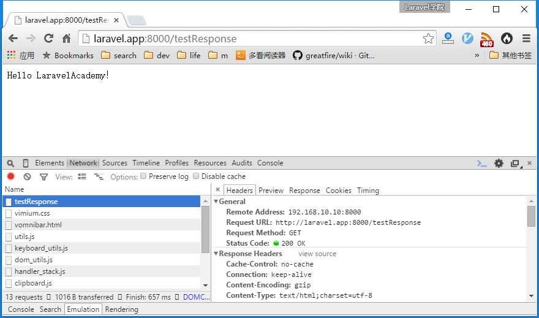
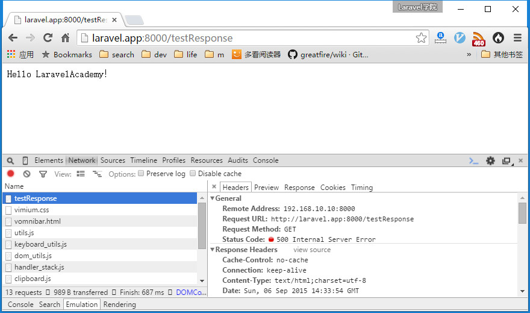
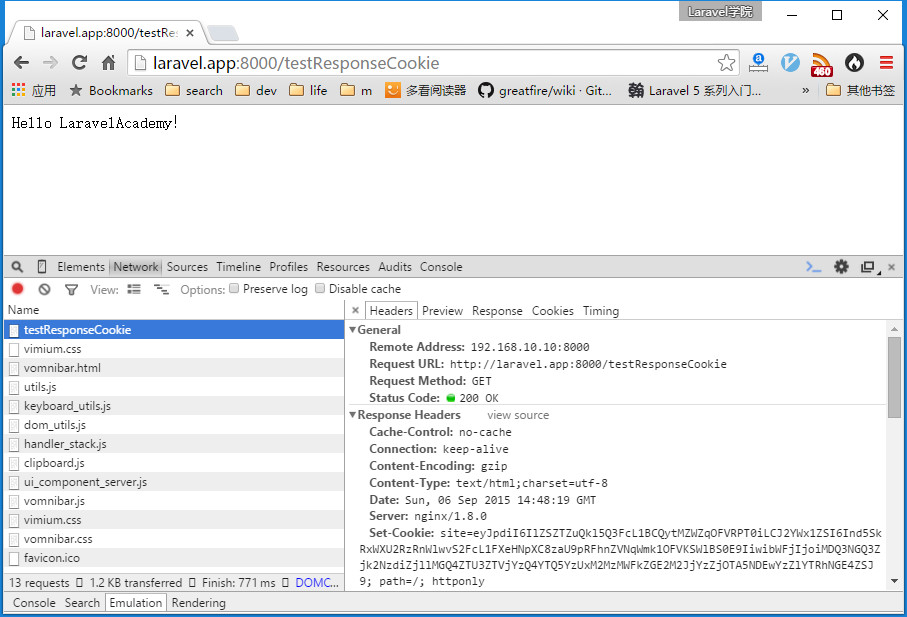
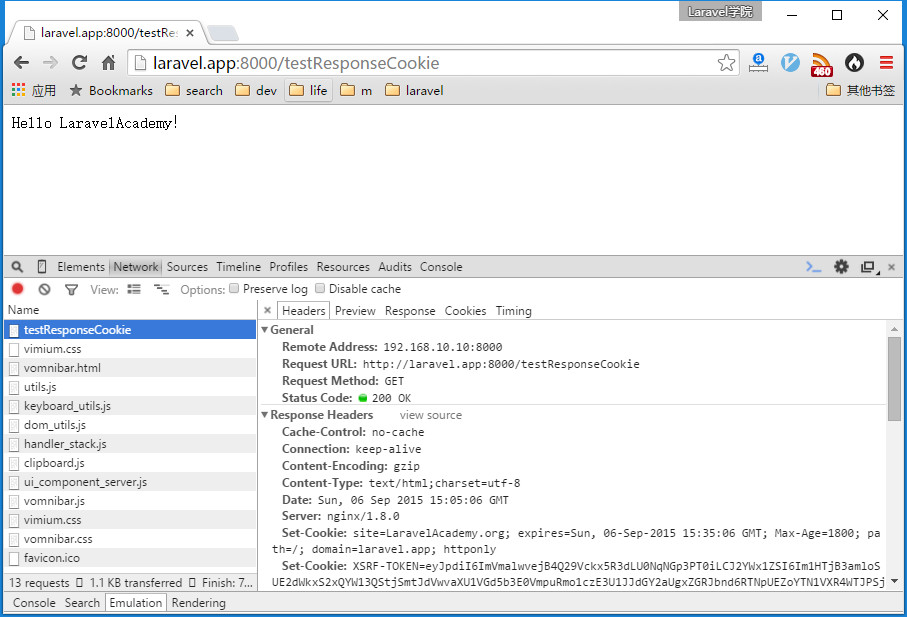
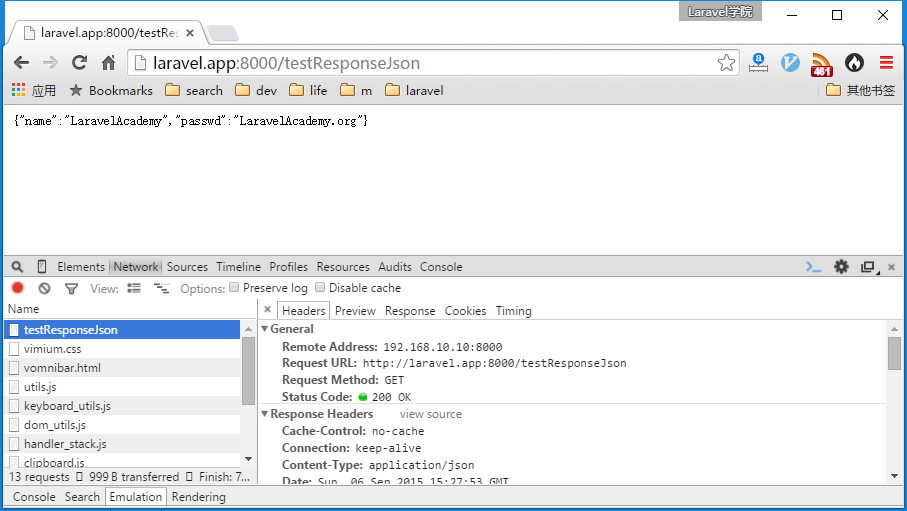

##HTTP响应实例教程

###Response篇

####基本响应

最基本的HTTP响应只需在路由闭包或控制器动作中返回一个简单字符串即可，但是具体业务逻辑中大部分响应都是在控制器动作中返回Response实例或者视图。Response是继承自 Symfony\Component\HttpFoundation\Response的 Illuminate\Http\Response类的一个实例，我们可以使用该实例上的一系列方法来创建HTTP响应：

```php
use Illuminate\Http\Response;

Route::get('testResponse',function(){
    $content = 'Hello LaravelAcademy！';
    $status = 200;
    $value = 'text/html;charset=utf-8';
    return (new Response($content,$status))->header('Content-Type',$value);
});
```

在浏览器中访问，F12查看响应头信息（Chrome浏览器）：



如果我们尝试修改$status=500，则头信息如下：



为方便使用，我们还可以使用全局帮助函数response来替代生成Response对象实例：

```php
Route::get('testResponse',function(){
    $content = 'Hello LaravelAcademy！';
    $status = 500;
    $value = 'text/html;charset=utf-8';
    return response($content,$status)->header('Content-Type',$value);
});
```

效果一样。以后我们将默认使用这种方式，不再生成Response对象实例。

此外，需要注意的是，Illuminate\Http\Response 类中还使用了ResponseTrait，header方法正是该trait提供的，除了header之外，该trait还提供了withCookie、content和status方法。header方法用于设置响应头信息，withCookie方法用于添加cookie，这两个方法都会返回调用它的Response自身对象，所以这两个方法都支持方法链（即多次调用header或withCookie方法）；而content和status方法则用于返回当前响应的响应实体内容和响应状态码。

####生成Cookie

正如上面提到的，我们使用withCookie方法为响应添加cookie，由于header和withCookie支持方法链，所以我们可以这样使用：

```php
Route::get('testResponseCookie',function(){
    $content = 'Hello LaravelAcademy！';
    $status = 200;
    $value = 'text/html;charset=utf-8';
    return response($content,$status)->header('Content-Type',$value)
        ->withCookie('site','LaravelAcademy.org');
});
```

在浏览器中访问，F12查看Cookie信息：



我们还可以使用该cookie的有效期、作用域等信息：

```php
Route::get('testResponseCookie',function(){
    $content = 'Hello LaravelAcademy！';
    $status = 200;
    $value = 'text/html;charset=utf-8';
    //设置cookie有效期为30分钟，作用路径为应用根目录，作用域名为laravel.app
    return response($content,$status)->header('Content-Type',$value)
        ->withCookie('site','LaravelAcademy.org',30,'/','laravel.app');
});
```

注：withCookie方法实际上是调用了全局帮助函数cookie生成cookie，然后将cookie放到响应头中。

再次在浏览器中访问，F12查看cookie信息如下：


里面多出了有效期及作用域名等相关信息。

此外，我们还关注到该cookie是经过加密的，这一点我们在前面已经提到过，这是为了安全性考虑，如果要取消加密，在app/Http/Middleware/EncryptCookies.php文件中将对应的cookie名添加到EncryptCookies类属性$except中即可：

```php
<?php
namespace App\Http\Middleware;
use Illuminate\Cookie\Middleware\EncryptCookies as BaseEncrypter;
class EncryptCookies extends BaseEncrypter
{
    /**
     * 不被加密的cookie名
     *
     * @var array
     */
    protected $except = [
        'site'
    ];
}
```

再次在浏览器中访问http://laravel.app:8000/testResponseCookie，F12查看Cookie信息如下：



当然，为了安全起见，我们不建议这么做。

###ResponseFactory篇

response函数如果不传入参数会返回 Illuminate\Contracts\Routing\ResponseFactory契约的实现——Illuminate\Routing\ResponseFactory，该类中提供了多个方法用来生成更加丰富的响应类型，比如视图响应、JSON响应、文件下载等等。

####视图响应

使用view方法即可返回一个视图作为响应内容：

```php
Route::get('testResponseView',function(){
    $value = 'text/html;charset=utf-8';
    return response()->view('hello',['message'=>'Hello LaravelAcademy'])
        ->header('Content-Type',$value);
});
```

与之对应的，我们需要在resources/views下新建一个视图文件hello.blade.php，其内容如下：

```php
{{$message}}
```

接下来我们在浏览器中访问http://laravel.app:8000/testResponseView，页面输出：

```php
Hello LaravelAcademy
```

还可以再简化，如果我们不需要自定义HTTP响应头，还可以直接使用全局帮助函数view：

```php
Route::get('testResponseView',function(){
    $value = 'text/html;charset=utf-8';
    return view('hello',['message'=>'Hello LaravelAcademy']));
});
```

效果和上面一样。

####JSON/JSONP

还可以使用json方法返回json格式数据：

```php
Route::get('testResponseJson',function(){
    return response()->json(['name'=>'LaravelAcademy','passwd'=>'LaravelAcademy.org']);
});
```

在浏览器中访问，F12查看响应头信息：



根据输出信息可见，json方法会自动设置Content-Type为application/json，并调用PHP内置函数json_encode讲数组转化为json格式字符串。

如果返回的是JSONP响应，也很简单，只需要在json后面再调用setCallback即可：

```php
Route::get('testResponseJson',function(){
    return response()->json(['name'=>'LaravelAcademy','passwd'=>'LaravelAcademy.org'])
        ->setCallback(request()->input('callback'));
});
```

####文件下载及重定向

使用download方法可生成用于下载给定路径文件的响应，这里我们下载上一节上传的文件：

```php
Route::get('testResponseDownload',function(){
    return response()->download(
        realpath(base_path('public/images')).'/laravel-5-1.jpg',
        'Laravel学院.jpg'
    );
});
```

在浏览器中访问http://laravel.app:8000/testResponseDownload，页面将会下载laravel-5-1.jpg文件并保存为Laravel学院.jpg。

###RedirectResponse篇

重定向响应是 Illuminate\Http\RedirectResponse类的实例，我们通常使用全局帮助函数redirect来生成 RedirectResponse实例。和response类似，redirect函数如果接收参数则调用的是Illuminate\Routing\Redirector类的to方法，如果无参调用则返回的是Redirector对象实例。

####基本重定向

```php
Route::get('dashboard', function () {
    return redirect('home/dashboard');
});
```

如果要重定向到上一个位置，则使用back方法：

```php
Route::post('user/profile', function () {
    // 验证请求...
    return back()->withInput();
});
```

####重定向到命名路由

使用route方法重定向到命名路由：

```php
Route::get('/hello/laravelacademy',['as'=>'academy',function(){
    return 'Hello LaravelAcademy';
}]);

Route::get('testResponseRedirect',function(){
    return redirect()->route('academy');
});
```

在浏览器中访问http://laravel.app:8000/testResponseRedirect，页面会跳转到http://laravel.app:8000/hello/laravelacademy并输出：

```php
Hello LaravelAcademy
```

如果命名路由中有参数，那么我们可以在route中传入参数：

```php
Route::get('/hello/laravelacademy/{id}',['as'=>'academy',function($id){
    return 'Hello LaravelAcademy '.$id;
}]);

Route::get('testResponseRedirect',function(){
    return redirect()->route('academy',100);
});
```

在浏览器中访问http://laravel.app:8000/testResponseRedirect，页面会跳转到http://laravel.app:8000/hello/laravelacademy/100并输出：

```php
Hello LaravelAcademy 100
```

####重定向到控制器动作

使用action方法重定向到控制器动作：

```php
Route::resource('post','PostController');

Route::get('testResponseRedirect',function(){
    return redirect()->action('PostController@index');
});
```

在浏览器中访问http://laravel.app:8000/testResponseRedirect，则页面会跳转到http://laravel.app:8000/post并输出对应内容。

当然也可以传递参数到action方法：

```php
Route::get('testResponseRedirect',function(){
    return redirect()->action('PostController@show',[1]);
});
```

####带一次性Session数据的重定向

使用with方法可以携带一次性session数据到重定向请求页面（一次性session数据即使用后立即销毁的session数据项）：

```php
Route::post('user/profile', function () {
    // 更新用户属性...
    return redirect('dashboard')->with('status', 'Profile updated!');
});
```

这种特性通常在提交表单验证失败返回错误信息时很有用。