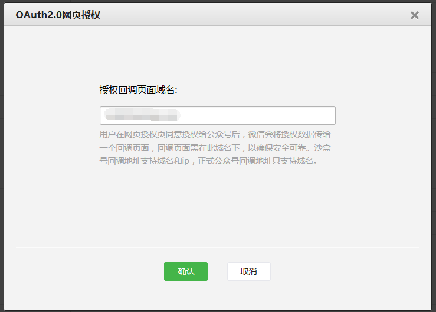

##laravel5.2+wechat开发笔记-页面授权

###修改wechat配置

在config/wechat.php中开启一下配置

```php
'oauth' => [
    'scopes'   => array_map('trim', explode(',', env('WECHAT_OAUTH_SCOPES', 'snsapi_userinfo'))),
    'callback' => env('WECHAT_OAUTH_CALLBACK', '/examples/oauth_callback.php'),
],
```

在.env文件中配置对应的环境变量

```php
WECHAT_OAUTH_SCOPES=snsapi_userinfo
WECHAT_OAUTH_CALLBACK=/wechat/callback
```

###创建路由

这里的路由即可以放在有web中间件过滤的路由群组中，也可以不放在路由群组中。

```php
Route::get('wechat/start','WechatController@start');
Route::any('wechat/callback','WechatController@callback');
```

###创建控制器

在WechatController中创建以下方法。

```php
//发起微信授权登陆
public function start(Application $wechat){
    $oauth = $wechat->oauth;
    return $oauth->redirect();
}

//微信授权登陆回调地址
public function callback(Application $wechat){
    $oauth = $wechat->oauth;
    $user = $oauth->user();
    dd($user->toArray());
}
```

###微信公众账号设置

进入微信公众平台，设置网页授权回调域名：查看接口权限-->网页账号-->修改



这样就可以通过访问域名对应的路由，进行页面授权了。