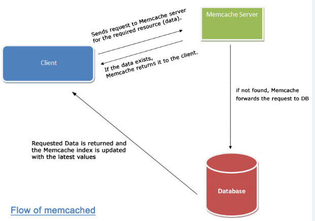
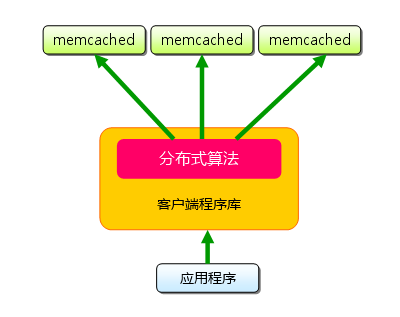
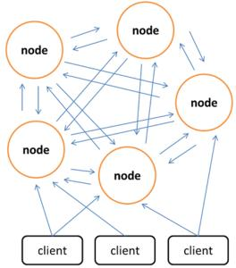

##Memcached,Redis方案对比与分析

###Memcached方案

Memcached(内存Key-Value Cache)一个高性能的分布式内存对象缓存系统，用于动态Web应用以减轻数据库负载。它通过在内存中缓存数据和对象来减少读取数据库的次数，从而提供动态、数据库驱动网站的速度。

####Memcached工作方式分析

许多Web应用都将数据保存到 RDBMS中，应用服务器从中读取数据并在浏览器中显示。 但随着数据量的增大、访问的集中，就会出现RDBMS的负担加重、数据库响应恶化、 网站显示延迟等重大影响。Memcached是高性能的分布式内存缓存服务器,通过缓存数据库查询结果，减少数据库访问次数，以提高动态Web等应用的速度、 提高可扩展性。下图展示了memcache与数据库端协同工作情况：

其中的过程是这样的：

1. 检查用户请求的数据是缓存中是否有存在，如果有存在的话，只需要直接把请求的数据返回，无需查询数据库。
2. 如果请求的数据在缓存中找不到，这时候再去查询数据库。返回请求数据的同时，把数据存储到缓存中一份。
3. 保持缓存的“新鲜性”，每当数据发生变化的时候（比如，数据有被修改，或被删除的情况下），要同步的更新缓存信息，确保用户不会在缓存取到旧的数据。

Memcached作为高速运行的分布式缓存服务器，具有以下的特点： 

1. 协议简单 
2. 基于libevent的事件处理 
3. 内置内存存储方式
4. memcached不互相通信的分布式

####如何实现分布式可拓展性

Memcached的分布式不是在服务器端实现的，而是在客户端应用中实现的，即通过内置算法制定目标数据的节点，如下图所示：

###Redis方案

Redis是一个key-value存储系统。和Memcached类似，它支持存储的value类型相对更多，包括string(字符串)、 list(链表)、set(集合)和zset(有序集合)。这些数据类型都支持push/pop、add/remove及取交集并集和差集及更丰富的操作，而且这些操作都是原子性的。在此基础上，redis支持各种不同方式的排序。与memcached一样，为了保证效率，数据都是缓存在内存中。区别的是redis会周期性的把更新的数据写入磁盘或者把修改操作写入追加的记录文件，并且在此基础上实现了master-slave(主从)同步,当前 Redis的应用已经非常广泛。

####Redis工作方式分析

Redis作为一个高性能的key-value数据库具有以下特征： 

1. 多样的数据模型 
2. 持久化 
3. 主从同步  

Redis支持丰富的数据类型，最为常用的数据类型主要由五种：String、Hash、List、Set和Sorted Set。Redis通常将数据存储于内存中，或被配置为使用虚拟内存。Redis有一个很重要的特点就是它可以实现持久化数据，通过两种方式可以实现数据持久化：使用RDB快照的方式，将内存中的数据不断写入磁盘；或使用类似MySQL的AOF日志方式，记录每次更新的日志。前者性能较高，但是可能会引起一定程度的数据丢失；后者相反。 Redis支持将数据同步到多台从数据库上，这种特性对提高读取性能非常有益。

###如何实现分布式可拓展性

2.8以前的版本：与Memcached一致，可以在客户端实现，也可以使用代理，twitter已开发出用于Redis和Memcached的代理Twemproxy 。

3.0 以后的版本：相较于Memcached只能采用客户端实现分布式存储，Redis则在服务器端构建分布式存储。Redis Cluster是一个实现了分布式且允许单点故障的Redis高级版本，它没有中心节点，各个节点地位一致，具有线性可伸缩的功能。如图给出Redis Cluster的分布式存储架构，其中节点与节点之间通过二进制协议进行通信，节点与客户端之间通过ascii协议进行通信。在数据的放置策略上，Redis Cluster将整个 key的数值域分成16384个哈希槽，每个节点上可以存储一个或多个哈希槽，也就是说当前Redis Cluster支持的最大节点数就是16384

###综合结论

应该说Memcached和Redis都能很好的满足解决我们的问题，它们性能都很高，总的来说，可以把Redis理解为是对Memcached的拓展，是更加重量级的实现，提供了更多更强大的功能。具体来说：

####性能上：

性能上都很出色，具体到细节，由于Redis只使用单核，而Memcached可以使用多核，所以平均每一个核上Redis在存储小数据时比Memcached性能更高。而在100k以上的数据中，Memcached性能要高于Redis，虽然Redis最近也在存储大数据的性能上进行优化，但是比起 Memcached，还是稍有逊色。

####内存空间和数据量大小：

MemCached可以修改最大内存，采用LRU算法。Redis增加了VM的特性，突破了物理内存的限制。

####操作便利上:

MemCached数据结构单一，仅用来缓存数据，而Redis支持更加丰富的数据类型，也可以在服务器端直接对数据进行丰富的操作,这样可以减少网络IO次数和数据体积。

####可靠性上：

MemCached不支持数据持久化，断电或重启后数据消失，但其稳定性是有保证的。Redis支持数据持久化和数据恢复，允许单点故障，但是同时也会付出性能的代价。

####应用场景：

Memcached：动态系统中减轻数据库负载，提升性能；做缓存，适合多读少写，大数据量的情况（如人人网大量查询用户信息、好友信息、文章信息等）。

Redis：适用于对读写效率要求都很高，数据处理业务复杂和对安全性要求较高的系统（如新浪微博的计数和微博发布部分系统，对数据安全性、读写要求都很高）。

###需要慎重考虑的部分

1. Memcached单个key-value大小有限，一个value最大只支持1MB，而Redis最大支持512MB
2. Memcached只是个内存缓存，对可靠性无要求；而Redis更倾向于内存数据库，因此对对可靠性方面要求比较高
3. 从本质上讲，Memcached只是一个单一key-value内存Cache；而Redis则是一个数据结构内存数据库，支持五种数据类型，因此Redis除单纯缓存作用外，还可以处理一些简单的逻辑运算，Redis不仅可以缓存，而且还可以作为数据库用
4. 新版本（3.0）的Redis是指集群分布式，也就是说集群本身均衡客户端请求，各个节点可以交流，可拓展行、可维护性更强大。
