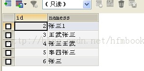
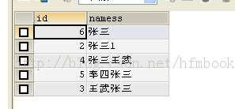

##mysql搜索结果排序

###按照指定字段自然排序

```mysql
//顺序排列
SELECT * FROM tablename order by columnname DESC;
//倒序排列
SELECT * FROM tablename order by columnname DESC;
```

###统计排序

```mysql
SELECT count(id) AS ids,groupcolumn FROM tablename group by groupcolumn order by ids DESC;

###按照匹配度进行排序

实现类似搜索引擎的功能，实现匹配度查询。

常规查询语句

```mysql
SELECT * FROM `people` WHERE namess LIKE  '%张%';
```



```mysql
SELECT * FROM `people` WHERE namess LIKE  '%张%' ORDER BY  REPLACE(namess,'张','')
```



###根据find_in_set

mysql进行排序的时候如果需要按照原始的顺序排序就可以使用order by find_in_set()方法，具体用法如下：

```mysql
select * from ecs_goods where goods_id in ($idList) order by FIND_IN_SET(goods_id,'$idList');
```