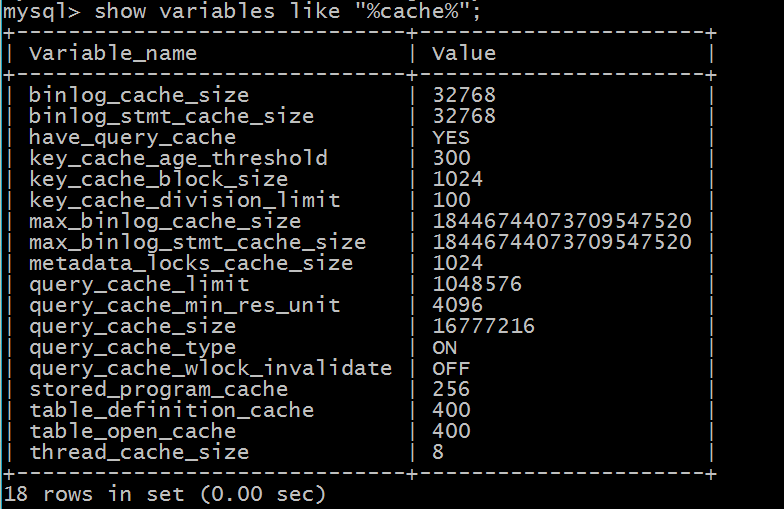
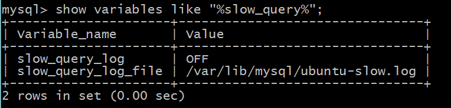

## mysql查询优化

### 创建索引

#### 创建索引的意义

在数据库的CURD操作中，查询（R）操作占据了绝大部分的比例，所以查询（R）的性能基本上决定了应用的性能。对于优化查询性能最常用的就是创建索引。2000万比数据，每条记录200字节的varchar类型查询。如果不使用索引，查询一条记录需要一分钟，而建立索引后，时间可以忽略不计。

#### 创建索引的弊端

1. 在插入(C)数据时，创建索引是需要消耗时间，这使得插入性能降低。
2. 如果索引字段varchar长度超多64字节，则会额外增加2个字节记录索引的长度，不管储存的实际长度是否大于64。这样会使数据库文件变的更大。
3. 当储存的数据很大一部分是重复记录是，创建索引并不能提高查询效率。这是还要承受创建索引带来的性能消耗。

### 缓存配置

在MySQL中有多种多样的缓存，有的缓存负责缓存查询语句，也有的负责缓存查询数据。这些缓存内容客户端无法操作，是由server端来维护。它会随着你查询与修改等相应不同操作进行不断更新。通过其配置文件我们可以看到在MySQL中的缓存：



想要使用query cache时，只需要将query_cache_size设置大于0就可以。query cache开启后，server端就会缓存每次查询返回的结果，如果查询相同的数据就直接从缓存中获取数据。当query_cache_size设置的足够大，数据可能完全缓存在内存中个，那么查询的速度将会非常快。

但query cache也有弊端，当你对数据的更新操作（CUD）数据非常频繁时，server为了保证缓存与数据库的一致性，会轻质刷新缓存数据，导致缓存数据全部失效。所以当一个表的更新操作非常多时，query cache的查询效率是不会提高的。反而会影响其他的操作性能。

设置缓存大小命令：

```mysql
set @@global.query_cache_size=100000000;
```

### 查询慢日志

开启查询日志，并设置慢查询时间（long_query_time），如果查询操作超过该时间，就会记录在查询日志中。然后通过分析查询日志，优化响应的查询语句。

查看slow_query_log设置



开启慢日志

```mysql
set global slow_query_log=ON;
set global slow_launch_time=5;
```

配置/etc/mysql/my.cnf文件，设置日志储存地址。

```mysql
slow_query_log_file=/mysql/log/nagiosdb-slow.log
slow_launch_time=5
```