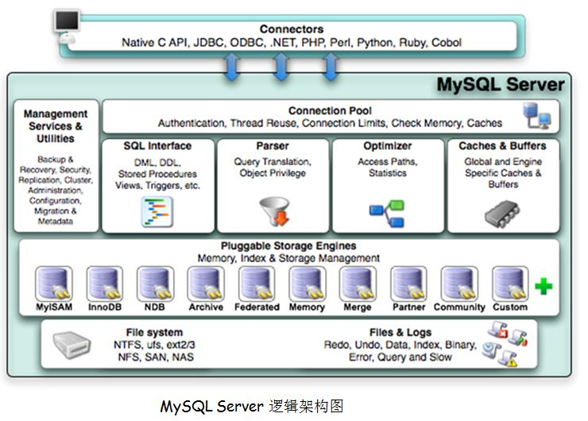

## mysql知识点汇总

### 索引

### 数据库缓存

### myIsam底层原理及知识点

### InnoDB

### MyIsam与InnoDB

### 小知识点

#### 前缀索引

如果需要的索引是很长的字符列，这会让索引变的大且慢。且字符串的前缀差异较大，就可以使用前缀索引。

```
# 语法
ALTER TABLE table_name ADD KEY(column_name(prefix_length));
# 示例
ALTER TABLE city ADD KEY(cityname(7))
```

#### 单列索引

#### 多列索引

#### 复合索引又名联合索引

#### 聚集索引和非聚集索引（辅助索引 / 二级索引）

聚集索引：B+树的叶子节点存放的是整张表的行记录数据，非叶子节点只存储检索相关的信息；其中，有主键则定义主键索引为聚集索引；没有主键则选第一个不允许为NULL的唯一索引；还没有就使用innodb的内置rowid为聚集索引。一个表中只能存在一个聚集索引。

非聚集索引：与聚集索引的不同点是辅助索引的B+树的叶子节点只存放索引的key和主键值。

##### 聚集索引

索引的键值逻辑顺序决定了表数据行的物理存储顺序，也就是在数据库上连接的记录在磁盘上的物理存储地址也是相邻的，注意这一点特性，我们可以分析出它的适用情况。由于聚集索引规定了数据项，也可以说是记录在表中的物理存储顺序，物理顺序唯一，自然每张表中的聚集索引也是唯一的，但是它可以包含多个列，多个字段。

    聚集索引类似于新华字典中用拼音去查找汉字，拼音检索表于书记顺序都是按照a~z排列的，就像相同的逻辑顺序于物理顺序一样，当你需要查找a,ai两个读音的字，或是想一次寻找多个傻(sha)的同音字时，也许向后翻几页，或紧接着下一行就得到结果了。

进一步来说，当你需要查询的数据经常被分组看待（分类），或是经常查询范围性的数据（本月，本周总结），不同值的小数目等情况时，可以使用聚集索引。

##### 非聚集索引

自然，非聚集索引也就是存储的键值逻辑连续，但是在表数据行物理存储顺序上不一定连续的索引，也就是索引的逻辑顺序与磁盘上的物理存储顺序不同。

    非聚集索引类似在新华字典上通过偏旁部首来查询汉字，检索表也许是按照横、竖、撇来排列的，但是由于正文中是a~z的拼音顺序，所以就类似于逻辑地址于物理地址的不对应。同时适用的情况就在于分组，大数目的不同值，频繁更新的列中，这些情况即不适合聚集索引。


#### 覆盖索引

其实mysql可以使用索引来直接获取列的数据。如果索引的叶子节点包含了要查询的数据，那么就不用回表查询了，也就是说这种索引包含（亦称覆盖）所有需要查询的字段的值，我们称这种索引为覆盖索引。

InnoDB
1. 覆盖索引查询时除了除了索引本身的包含的列，还可以使用其默认的聚集索引列。
2. 这跟INNOB的索引结构有关系，主索引是B+树索引存储，也即我们所说的数据行即索引，索引即数据。
3. 对于INNODB的辅助索引，它的叶子节点存储的是索引值和指向主键索引的位置，然后需要通过主键在查询表的字段值，所以辅助索引存储了主键的值。
4. 覆盖索引也可以用上INNODB 默认的聚集索引。
5. innodb引擎的所有储存了主键ID，事务ID，回滚指针,非主键ID，他的查询就会是非主键ID也可覆盖来取得主键ID。

### MySQL索引使用的数据结构：B-Tree和B+Tree

MyISAM是MySQL 5.5之前版本默认的存储引擎，从5.5之后，InnoDB开始成为MySQL默认的存储引擎。

MyISAM使用B-Tree实现主键索引、唯一索引和非主键索引。

InnoDB中非主键索引使用的是B-Tree数据结构，而主键索引使用的是B+Tree。

### EXPLAIN

EXPLAIN可以用来查看一个SQL语句的执行计划。

```
explain select * from servers;
+----+-------------+---------+------+---------------+------+---------+------+------+-------+
| id | select_type | table   | type | possible_keys | key  | key_len | ref  | rows | Extra |
+----+-------------+---------+------+---------------+------+---------+------+------+-------+
|  1 | SIMPLE      | servers | ALL  | NULL          | NULL | NULL    | NULL |    1 | NULL  |
+----+-------------+---------+------+---------------+------+---------+------+------+-------+
```

#### id

1. id相同时，执行顺序由上至下
2. 如果是子查询，id的序号会递增，id值越大优先级越高，越先被执行
3. id如果相同，可以认为是一组，从上往下顺序执行；在所有组中，id值越大，优先级越高，越先执行

#### select

select_type 表示了查询的类型, 它的常用取值有:

- SIMPLE, 表示此查询不包含 UNION 查询或子查询
- PRIMARY, 表示此查询是最外层的查询
- UNION, 表示此查询是 UNION 的第二或随后的查询
- DEPENDENT UNION, UNION 中的第二个或后面的查询语句, 取决于外面的查询
- UNION RESULT, UNION 的结果
- SUBQUERY, 子查询中的第一个 SELECT
- DEPENDENT SUBQUERY: 子查询中的第一个 SELECT, 取决于外面的查询. 即子查询依赖于外层查询的结果.

#### table

表示查询涉及的表或衍生表

#### type

type字段比较重要, 它提供了判断查询是否高效的重要依据依据. 通过 type 字段, 我们判断此次查询是全表扫描还是索引扫描等。

type 常用的取值有:

- system: 表中只有一条数据. 这个类型是特殊的 const 类型.
- const: 针对主键或唯一索引的等值查询扫描, 最多只返回一行数据. const查询速度非常快, 因为它仅仅读取一次即可.
- eq_ref: 此类型通常出现在多表的 join 查询, 表示对于前表的每一个结果, 都只能匹配到后表的一行结果. 并且查询的比较操作通常是=, 查询效率较高.
- ref: 此类型通常出现在多表的join查询, 针对于非唯一或非主键索引, 或者是使用了最左前缀规则索引的查询. 
- range: 表示使用索引范围查询, 通过索引字段范围获取表中部分数据记录. 这个类型通常出现在 =, <>, >, >=, <, <=, IS NULL, <=>, BETWEEN, IN() 操作中.
- index: 表示全索引扫描(full index scan), 和 ALL 类型类似, 只不过 ALL 类型是全表扫描, 而 index 类型则仅仅扫描所有的索引, 而不扫描数据.index 类型通常出现在: 所要查询的数据直接在索引树中就可以获取到, 而不需要扫描数据. 当是这种情况时, Extra 字段 会显示 Using index.（覆盖索引）
- ALL: 表示全表扫描, 这个类型的查询是性能最差的查询之一. 通常来说, 我们的查询不应该出现 ALL 类型的查询, 因为这样的查询在数据量大的情况下, 对数据库的性能是巨大的灾难. 如一个查询是 ALL 类型查询, 那么一般来说可以对相应的字段添加索引来避免.

#### key

此字段是 MySQL 在当前查询时所真正使用到的索引.

#### key_len

表示查询优化器使用了索引的字节数. 这个字段可以评估组合索引是否完全被使用, 或只有最左部分字段被使用到.
key_len 的计算规则如下:

- 字符串
    - char(n): n 字节长度
    - varchar(n): 如果是 utf8 编码, 则是 3 n + 2字节; 如果是 utf8mb4 编码, 则是 4 n + 2 字节.
- 数值类型:
    - TINYINT: 1字节
    - SMALLINT: 2字节
    - MEDIUMINT: 3字节
    - INT: 4字节
    - BIGINT: 8字节
- 时间类型
    - DATE: 3字节
    - TIMESTAMP: 4字节
    - DATETIME: 8字节
    - 字段属性: NULL 属性 占用一个字节. 如果一个字段是 NOT NULL 的, 则没有此属性.
#### ref

表示上述表的连接匹配条件，即哪些列或常量被用于查找索引列上的值

#### rows

rows 也是一个重要的字段. MySQL 查询优化器根据统计信息, 估算 SQL 要查找到结果集需要扫描读取的数据行数.
这个值非常直观显示 SQL 的效率好坏, 原则上 rows 越少越好.

#### Extra

- Using where:列数据是从仅仅使用了索引中的信息而没有读取实际的行动的表返回的，这发生在对表的全部的请求列都是同一个索引的部分的时候，表示mysql服务器将在存储引擎检索行后再进行过滤
- Using temporary：表示MySQL需要使用临时表来存储结果集，常见于排序和分组查询
- Using filesort：MySQL中无法利用索引完成的排序操作称为“文件排序”
- Using join buffer：改值强调了在获取连接条件时没有使用索引，并且需要连接缓冲区来存储中间结果。如果出现了这个值，那应该注意，根据查询的具体情况可能需要添加索引来改进能。
- Impossible where：这个值强调了where语句会导致没有符合条件的行。
- Select tables optimized away：这个值意味着仅通过使用索引，优化器可能仅从聚合函数结果中返回一行

### MySQL逻辑架构



1. 最上层是一些客户端和连接服务，包含本地sock通信和大多数基于客户端/服务端工具实现的类似于tcp/ip的通信。主要完成一些类似于连接处理、授权认证、及相关的安全方案。在该层上引入了线程池的概念，为通过认证安全接入的客户端提供线程。同样在该层上可以实现基于SSL的安全链接。服务器也会为安全接入的每个客户端验证它所具有的操作权限。
2. 第二层架构主要完成大多少的核心服务功能，如SQL接口，并完成缓存的查询，SQL的分析和优化及部分内置函数的执行。所有跨存储引擎的功能也在这一层实现，如过程、函数等。在该层，服务器会解析查询并创建相应的内部解析树，并对其完成相应的优化如确定查询表的顺序，是否利用索引等，最后生成相应的执行操作。如果是select语句，服务器还会查询内部的缓存。如果缓存空间足够大，这样在解决大量读操作的环境中能够很好的提升系统的性能。（sql接口、分析程序、查询优化器、缓存）
3. 存储引擎层，存储引擎真正的负责了MySQL中数据的存储和提取，服务器通过API与存储引擎进行通信。不同的存储引擎具有的功能不同，这样我们可以根据自己的实际需要进行选取。
4. 数据存储层，主要是将数据存储在运行于裸设备的文件系统之上，并完成与存储引擎的交互。