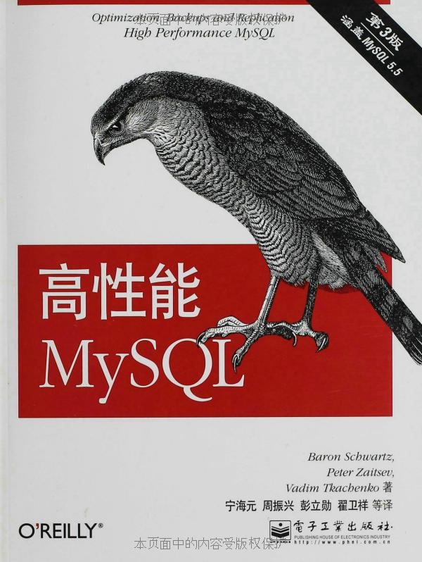
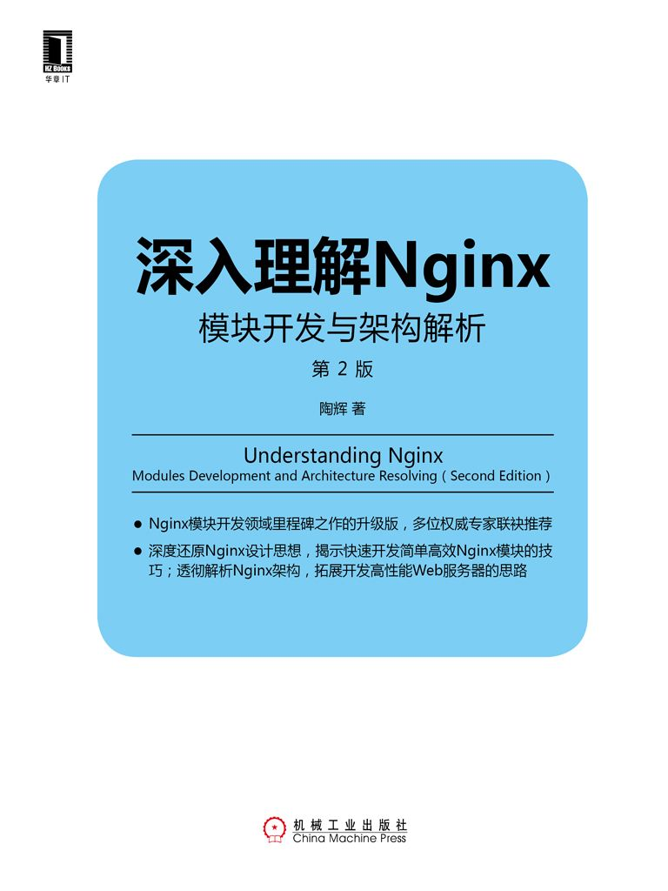
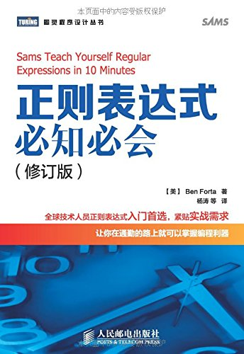
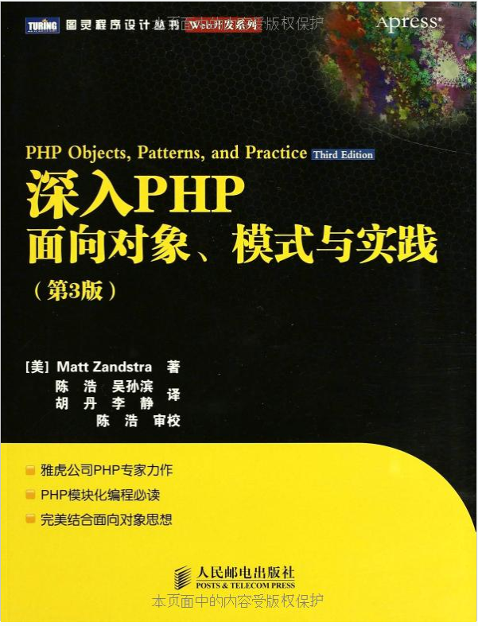
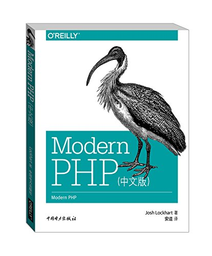
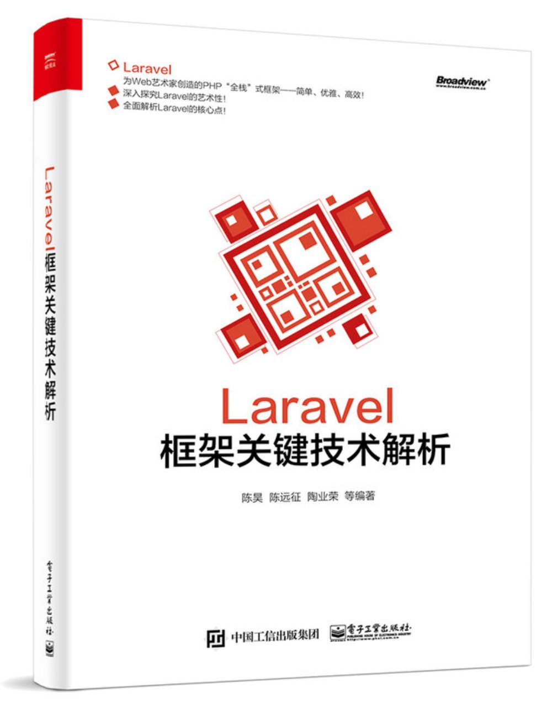

##php学习进阶书籍

###mysql学习

《高性能MySQL(第3版)》

php在大多数都是与数据库进行交互，数据库的设计如何将直接影响到程序开发。了解mysql数据库设计，是php必须的技能。但如果进阶的话，就需要这本数做为补充。

###服务器进阶

《深入理解Nginx:模块开发与架构解析(第2版)》

个人推荐对nginx多了解一些。

###php初学至进阶书籍

《PHP与Mysql动态网站开发（第4版）》

这本书讲的比较简单，很适合入门，关键是对一些关键的知识点讲的比较清除，给的例子虽然占用了太多篇幅，但是确实适合初学者进行理解。

《正则表达式必知必会（修订版）》

正则表示式是php中，重要但又不重要的一门语言。你可以不用非常了解，但是绝对不能缺少一本工具书。这本书讲解的非常简单，你可以先看一遍，了解概况后，在日后的工作中，随手拿出来翻一翻。 

《深入PHP:面向对象、模式与实践(第3版)》

这本书建议已经拥有一定开发经验的人来阅读，如果你使用的Thinkphp框架的话，那么这本书对你没有什么意义。但你试图理解laravel或者YII等框架的核心，那么这本书可以帮助你。

《Modern PHP(中文版)》

暂且不谈PHP7，就谈谈PHP5.6的新特性，在国内项目开发中依然并不怎么使用。从其它语言中，借鉴过来的优秀特性，国内php开发者依然无视，继续开发无法维护的代码。

这本书简单全面的介绍了php5.6以来php的新特性，帮助你理解在实际开发中的使用。

《Laravel框架关键技术解析》

我依然希望国内开发者果断放弃Thinkphp框架，拥抱laravel框架。

