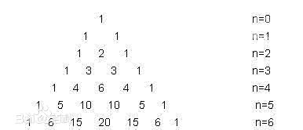

## php常用算法

### 排序算法

#### 冒泡排序

```php
function bubble_sort($array) { 
    $count = count($array); 
    if ($count <= 0 ) return false; 
    for($i=0 ; $i<$count; $i++){ 
            for($j=$count-1; $j>$i; $j--){ 
                    if ($array[$j] < $array[$j-1]){ 
                            $tmp = $array[$j]; 
                            $array[$j] = $array[$j-1]; 
                            $array[$j-1] = $tmp; 
                    } 
            } 
    } 
    return $array; 
}
```

#### 冒泡排序的改进：鸡尾酒排序

鸡尾酒排序，也叫定向冒泡排序，是冒泡排序的一种改进。此算法与冒泡排序的不同处在于从低到高然后从高到低，而冒泡排序则仅从低到高去比较序列里的每个元素。他可以得到比冒泡排序稍微好一点的效能。

```php
function Swap(array $A, $i, $j)
{
    int $temp = $A[i];
    $A[$i] = $A[$j];
    $A[j] = $temp;
}

void CocktailSort(array $A, $n)
{
    $left = 0;                            // 初始化边界
    $right = n - 1;
    while ($left < $right)
    {
        for ($i = $left; $i < $right; $i++)   // 前半轮,将最大元素放到后面
        {
            if ($A[i] > $A[i + 1])
            {
                Swap($A, $i, $i + 1);
            }
        }
        $right--;
        for ($i = $right; $i > $left; $i--)   // 后半轮,将最小元素放到前面
        {
            if ($A[$i - 1] > $A[$i])
            {
                Swap($A, $i - 1, $i);
            }
        }
        $left++;
    }
}
```

#### 快速排序

1. 从数列中挑出一个元素，称为 “基准”（pivot），
2. 重新排序数列，所有元素比基准值小的摆放在基准前面，所有元素比基准值大的摆在基准的后面（相同的数可以到任一边）。在这个分区退出之后，该基准就处于数列的中间位置。这个称为分区（partition）操作。
3. 递归地（recursive）把小于基准值元素的子数列和大于基准值元素的子数列排序。

```php
function quick_sort($array) { 
        if (count($array) <= 1) return  $array; 
        $key = $array[0]; 
        $left_arr  = array(); 
        $right_arr = array(); 
        for ($i= 1; $i<count($array); $i++){ 
                if ($array[ $i] <= $key) 
                    $left_arr[] = $array[$i]; 
                else 
                    $right_arr[] = $array[$i]; 
        } 
        $left_arr = quick_sort($left_arr); 
        $right_arr = quick_sort($right_arr); 
        return array_merge($left_arr , array($key), $right_arr); 
}
```

#### 插入排序

1. 从第一个元素开始，该元素可以认为已经被排序
2. 取出下一个元素，在已经排序的元素序列中从后向前扫描
3. 如果该元素（已排序）大于新元素，将该元素移到下一位置
4. 重复步骤3，直到找到已排序的元素小于或者等于新元素的位置
5. 将新元素插入到该位置后
6. 重复步骤2~5

```php
function insertSort($arr) {
    $len=count($arr); 
    for($i=1, $i<$len; $i++) {
        $tmp = $arr[$i];
        //内层循环控制，比较并插入
        for($j=$i-1;$j>=0;$j--) {
            if($tmp < $arr[$j]) {
                //发现插入的元素要小，交换位置，将后边的元素与前面的元素互换
                $arr[$j+1] = $arr[$j];
                $arr[$j] = $tmp;
            } else {
                //如果碰到不需要移动的元素，由于是已经排序好是数组，则前面的就不需要再次比较了。
                break;
            }
        }
    }
    return $arr;
}
```

#### 二分插入排序

和插入排序相比，就是第3步，不是从最左边开始比较，而是从中间开始向两遍进行比较。

```php
// 分类 -------------- 内部比较排序
// 数据结构 ---------- 数组
// 最差时间复杂度 ---- O(n^2)
// 最优时间复杂度 ---- O(nlogn)
// 平均时间复杂度 ---- O(n^2)
// 所需辅助空间 ------ O(1)
// 稳定性 ------------ 稳定

function InsertionSortDichotomy(array $A, $n)
{
    for (int $i = 1; $i < n; $i++)
    {
        $get = $A[$i];                    // 右手抓到一张扑克牌
        $left = 0;                    // 拿在左手上的牌总是排序好的，所以可以用二分法
        $right = $i - 1;                // 手牌左右边界进行初始化
        while ($left <= $right)            // 采用二分法定位新牌的位置
        {
            $mid = ceil(($left + $right) / 2);
            if ($A[$mid] > $get)
                $right = $mid - 1;
            else
                $left = $mid + 1;
        }
        for (int $j = $i - 1; $j >= $left; j--)    // 将欲插入新牌位置右边的牌整体向右移动一个单位
        {
            $A[$j + 1] = $A[$j];
        }
        $A[$left] = $get;                    // 将抓到的牌插入手牌
    }
}
```

#### 归并排序

归并排序的实现分为递归实现与非递归(迭代)实现。递归实现的归并排序是算法设计中分治策略的典型应用，我们将一个大问题分割成小问题分别解决，然后用所有小问题的答案来解决整个大问题。非递归(迭代)实现的归并排序首先进行是两两归并，然后四四归并，然后是八八归并，一直下去直到归并了整个数组。

　　归并排序算法主要依赖归并(Merge)操作。归并操作指的是将两个已经排序的序列合并成一个序列的操作，归并操作步骤如下：

1. 申请空间，使其大小为两个已经排序序列之和，该空间用来存放合并后的序列
2. 设定两个指针，最初位置分别为两个已经排序序列的起始位置
3. 比较两个指针所指向的元素，选择相对小的元素放入到合并空间，并移动指针到下一位置
4. 重复步骤3直到某一指针到达序列尾
5. 将另一序列剩下的所有元素直接复制到合并序列尾


#### 堆排序heapsort 

堆排序就是利用堆（假设利用大根堆）进行排序的方法，它的基本思想是：将待排序的序列构造成一个大根堆。此时，整个序列的最大值就是堆顶的根节点。将它移走（其实就是将其与堆数组的末尾元素交换，此时末尾元素就是最大值），然后将剩余的 n - 1 个序列重新构造成一个堆，这样就会得到 n 个元素中的次小的值。如此反复执行，便能得到一个有序序列了。

大根堆排序算法的基本操作：

1. 建堆，建堆是不断调整堆的过程，从 len/2 处开始调整，一直到第一个节点，此处 len 是堆中元素的个数。建堆的过程是线性的过程，从 len/2 到 0 处一直调用调整堆的过程，相当于 o(h1) + o(h2) …+ o(hlen/2) 其中 h 表示节点的深度， len/2 表示节点的个数，这是一个求和的过程，结果是线性的 O(n)。

2. 调整堆：调整堆在构建堆的过程中会用到，而且在堆排序过程中也会用到。利用的思想是比较节点i和它的孩子节点 left(i) , right(i)，选出三者最大(或者最小)者，如果最大（小）值不是节点i而是它的一个孩子节点，那边交互节点i和该节点，然后再调用调整堆过程，这是一个递归的过程。调整堆的过程时间复杂度与堆的深度有关系，是 lgn 的操作，因为是沿着深度方向进行调整的。

3. 堆排序：堆排序是利用上面的两个过程来进行的。首先是根据元素构建堆。然后将堆的根节点取出(一般是与最后一个节点进行交换)，将前面 len-1 个节点继续进行堆调整的过程，然后再将根节点取出，这样一直到所有节点都取出。堆排序过程的时间复杂度是 O(nlgn)。因为建堆的时间复杂度是 O(n)（调用一次）；调整堆的时间复杂度是 lgn，调用了 n-1 次，所以堆排序的时间复杂度是 O(nlgn)。


```php
//堆排序（对简单选择排序的改进）

function swap(array &$arr,$a,$b){
    $temp = $arr[$a];
    $arr[$a] = $arr[$b];
    $arr[$b] = $temp;
}

//调整 $arr[$start]的关键字，使$arr[$start]、$arr[$start+1]、、、$arr[$end]成为一个大根堆（根节点最大的完全二叉树）
//注意这里节点 s 的左右孩子是 2*s + 1 和 2*s+2 （数组开始下标为 0 时）
function HeapAdjust(array &$arr,$start,$end){
    $temp = $arr[$start];
    //沿关键字较大的孩子节点向下筛选
    //左右孩子计算（我这里数组开始下标识 0）
    //左孩子2 * $start + 1，右孩子2 * $start + 2
    for($j = 2 * $start + 1;$j <= $end;$j = 2 * $j + 1){
        if($j != $end && $arr[$j] < $arr[$j + 1]){
            $j ++; //转化为右孩子
        }
        if($temp >= $arr[$j]){
            break;  //已经满足大根堆
        }
        //将根节点设置为子节点的较大值
        $arr[$start] = $arr[$j];
        //继续往下
        $start = $j;
    }
    $arr[$start] = $temp;
}

function HeapSort(array &$arr){
    $count = count($arr);
    //先将数组构造成大根堆（由于是完全二叉树，所以这里用floor($count/2)-1，下标小于或等于这数的节点都是有孩子的节点)
    for($i = floor($count / 2) - 1;$i >= 0;$i --){
        HeapAdjust($arr,$i,$count);
    }
    for($i = $count - 1;$i >= 0;$i --){
        //将堆顶元素与最后一个元素交换，获取到最大元素（交换后的最后一个元素），将最大元素放到数组末尾
        swap($arr,0,$i);  
        //经过交换，将最后一个元素（最大元素）脱离大根堆，并将未经排序的新树($arr[0...$i-1])重新调整为大根堆
        HeapAdjust($arr,0,$i - 1);
    }
}

$arr = array(9,1,5,8,3,7,4,6,2);
HeapSort($arr);
var_dump($arr);
```

### 斐波那契数列

斐波那契数列 1,1,2,3,5,8,13,21 后一个数是前两个数相加

简单递归算法

```php
function fibon($n)  
{  
    $n++;  
    if($n <= 2)//递归出口  
    {  
        return 1;  
    }  
    return fibon($n-1) + fibon($n-2);  
}  
```

#### 优化算法思路

通过记录原先计算的值，达到优化，递归计算。

优化后的递归函数

```php
function fibonac($a, $b, $n)  
{  
    $n++;  
    if($n > 2)  
    {  
        return fibonac($a+$b,$a,$n-1);  
    }  
    return $a;  
}
```

优化后的常规函数

```php
function fibonac($n){
    $array = array();
    if($n > 2)  
    {  
        $array[0] = 1;
        $array[1] = 1;
        for($i=2; $i<$n; $i++){
            $array[$i] = $array[$i-1] + $array[$i-2];
        }
        return $array[$n];
    }else{
        return 1;
    }
}
```

### 杨辉三角



```php
function yangHuiSanjiao($init = 1, $depth = 8)
{
    $arr = array( array($init));
    for($i = 0; $i < $depth; $i++)
    {
        for($j = 0; $j <= $i + 1; $j++) //获取 ‘下一行的数目’=‘上一行的数目’+1
        {
            $arr[$i + 1][$j] = $arr[$i][$j] + $arr[$i][$j - 1];
        }
    }
   
    return $arr;
}
```
