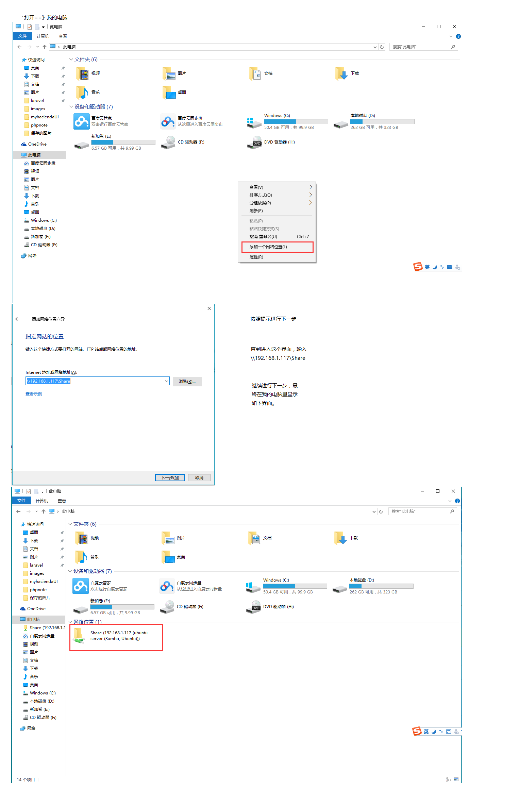

##ubuntu创建共享盘
###ubuntu上安装samba并创建共享目录
```shell
//安装samba
sudo apt-get insall samba 
//创建共享目录并修改权限
sudo mkdir /home/root/share
sudo chmod 777 /home/root/share 
```

修改配置文件

```shell
sudo vim /etc/samba/smb.conf
```

在smb.conf文件后面添加一下内容

```txt
security = user
[share]  
path = /home/phinecos/share  
available = yes 
browsealbe = yes 
public = yes 
writable = yes 
```

重启samba

```shell
sudo service samba restart
```

###在windows环境访问ubuntu共享目录设置
