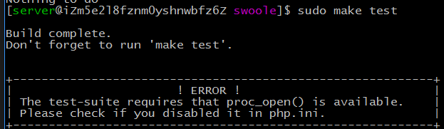
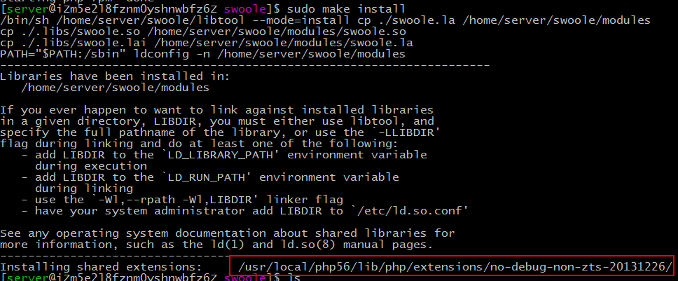
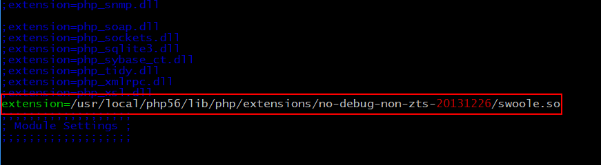

##安装swoole扩展

首先目前swoole并不支持在windows环境下安装，所以本文环境为centos。

###安装准备

安装swoole前必须保证系统已经安装了下列软件

php-5.3.10 或更高版本

gcc-4.4 或更高版本

make

autoconf

PCRE

###安装PCRE

```shell
sudo apt-get update
sudo apt-get install libpcre3 libpcre3-dev
```

可能还需要安装

```shell
sudo apt-get install openssl libssl-dev
```

###下载swoole源码

- [github下载源](https://github.com/swoole/swoole-src/releases)
- [pecl下载源](http://pecl.php.net/package/swoole)
- [oschina下载源](http://git.oschina.net/swoole/swoole)

我使用的是oschina的下载源，直接通过git克隆下来。

```shell
git clone https://git.oschina.net/swoole/swoole.git
```

我下载在centos的home目录下。

###编译和安装

```shell
cd swoole
sudo phpize
sudo ./configure
sudo make
sudo make test 
sudo make install
```

当我在执行sudo make test的时候，系统提示



这里需要找到php.ini文件取消proc_open函数的禁用。

可以通过运行php -i |grep php.ini找到php.ini文件。

找到 disable_functions选项，去除proc_open的禁用。

最后再执行sudo make install后，系统提示如下。



提示内容中，包含了扩展安装的位置。

###配置php.ini



###重启服务

```shell
service php-fpm restart
service nginx restart
```

最后可以通过运行php-m查看开启的扩展，或者打开phpinfo页面。


