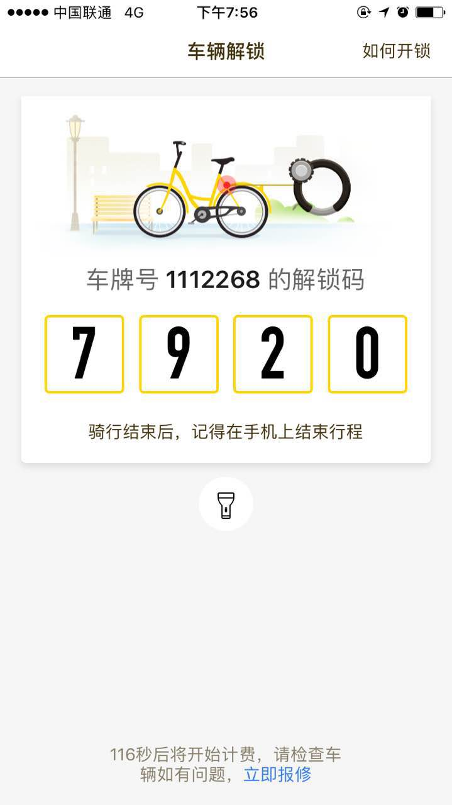
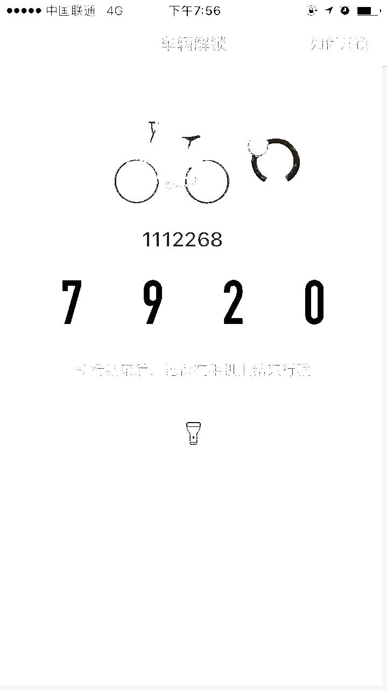

##提取图片中的数字

###想法

这两年深圳流行共享单车，其中ofo在设计上存在着大量的bug。这让我不由的想做点什么。

首先，ofo的机械锁密码是不变的，也就是说只要知道密码，我就可以免费骑单车。但是如果蹲在那里花几分钟去破解密码，一定会被看见的人鄙视，现在网络这么发达，分分钟把你放到网上去人肉。

那么就想搞一个共享密码的功能。靠我个人的力量，一年下来我全用ofo也就收集几百个密码。所以就需要大家的力量。但如果操作比较复杂的话，特别要输入两个数字，这个用户不买单，而且容易被别人恶意注入，使得我的数据不准确。

根据以上情况，我决定用户上传密码截图界面。



然后识别其中的两个重要数字，这样做能确保真实性，没人会为了污染我的数据库，去p很多张图片出来。

###遇到的问题

首先，为了识别图片中的文字，我使用tesseract。但发现，密码的数字无法识别，因为数字被一个框包住了。

###解决

针对上面的问题，我事先对照片进行处理。经过几次失败后，我最终的方案是，因为车辆编号的数字和密码都是黑色的。我要将其它的颜色全部转换成白色，这样就能进行识别了。



###代码

安装tesseract和gd库扩展在ubuntu下很简单，这里就不赘述了。

```php
//取图片，将所有非指定颜色的像素点，全部改为白色。
$im = imagecreatefromjpeg('./colours.jpg');
$x = imagesx($im)-10;
$y = imagesy($im)-10;
$white = imagecolorallocate($im, 255,255,255);
for($i=0;$i<=$x;$i++){
	for($j=0;$j<=$y;$j++){
		$color_num = imagecolorat($im,$i,$j);
		$r = ($color_num >> 16) & 0xFF;
		$g = ($color_num >> 8) & 0xFF;
		$b = $color_num & 0xFF;
		if($r<50 && $g<50 && $b<50){
			continue;
		}
		if($r==255 && $g==255 && $b==255){
			continue;
		}
		imagesetpixel ($im ,$i ,$j ,$white);
	}
}
imagejpeg($im, './black_num.jpg');
imagedestroy($im);
exec("tesseract black_num.jpg tesseract");
$content = file_get_contents("./tesseract.txt");
echo $content;
```

上面的代码只是简单的实现了从图片中百分之一百的获取到车辆编号和密码。

解决了上面的问题，不管是将功能整合到微信公众账号，或者个人网站中，都较为简单。