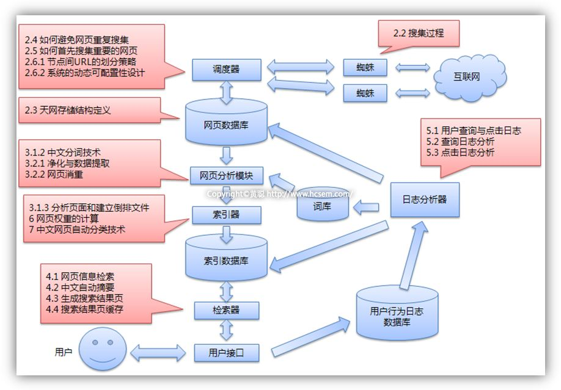
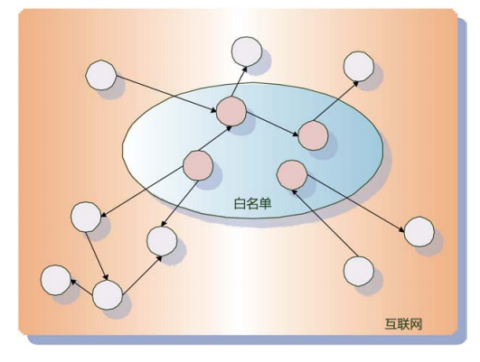
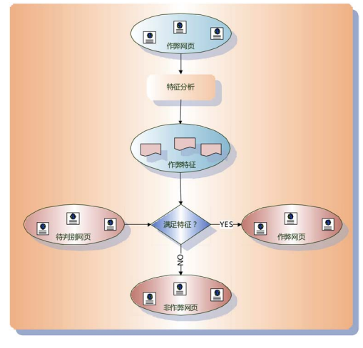

##搜索引擎基本原理

###搜索引擎概述
过去的15年间，互联网信息急剧膨胀，靠人工的方式去筛选获取有用信息不再可能，因此搜索引擎应运而生。根据其发展，可以将其划为四个时代。

- 分类目录。yahoo是这个时期的代表，采用纯人工方式收集，质量较高，但效率低。
- 文本检索。采用了经典的信息检索模型，主要查询用户关键词语网页内容相似度，收录容量增加，但质量不是很好。如，早期的AltaVista.
- 链接分析。典型：Google的PageRank，极大扩充了网页内容，质量有提高，随之而来各种作弊方法。
- 用户为中心？现在的大部分搜索引擎对相同查询返回相同的结果，但是不同用户可能关注不一样，未来也许更多考虑用户的差异性。

说到发展，不得不提搜索引擎的三个主要目标，无论它往何方发展，以下三个目标总是一个很好的评估标准：

- 更全：如何把更多相关的网页收录？
- 更快：如何从数以亿计的网页中迅速返回结果？
- 更准：如何把用户最感兴趣的结果呈现？

###搜索引擎的基础技术
这一部分主要从以下四个部分来讲述搜索引擎的基础技术，这四个部分也是搜索引擎的重要环节。

####网络爬虫
网络爬虫是搜索引擎的下载系统，它的作用是内容的获取，手段就是在万维网中通过链接不断爬取收集各类网页。但是互联网的页面浩如烟海，而且每天不断有新的内容产生，根据爬取目标和范围，可以将爬虫简单分为以下几类：

- 批量性爬虫：明确的抓取目标和范围，达到即停止
- 增量型爬虫：应对网页不断更新的状态，爬虫需要及时反应。通用商业引擎一般都是这类
- 垂直型爬虫：只针对某个特定领域的爬虫，根据主题过滤。

爬虫在爬取网页的时候，应该怎样确定下一步的目标呢？主要有以下策略：

- 宽度优先：最简单的方式，即将某个页面中的链接依次加入待爬取队列
- 局部PageRank：PageRank是一种网页重要性指标，这种方式根据一定时期内的局部PageRank值决定下一步爬取目标
- OPIC：当下载当前网页后，将其重要性平均分给包含的链接，每次选取最重要的页面，不用迭代计算，速度较快
- 大站优先：思想很简单，以网站为单位衡量页面重要性。

接下来，简要介绍一下搜索引擎中的一个重要问题：暗网抓取。所谓暗网，是指常规方式很难爬到的网页，而在网络中，这样的网是大量存在的。有的网页没有外链，有的主要内容存储于数据库中(如携程网)，没有链接指向这些记录。暗网挖掘是商业搜索引擎的一大研究重点，Google是这样，百度的“阿拉丁”计划也在于此。

####建立索引
对于搜索引擎，索更是其中最重要的核心技术之一，面对海量的网页内容，如何快速找到包含用户查询词的所有网页？倒排索引在其中扮演了关键的角色。

对于一个网页，我们把它看做一个文档，其中的内容由一个个单词组成。为了对于用户的搜索词快速给出文档结果，我们要建立一个单词-文档的存储结构。倒排索引是实现单词—文档矩阵的一种具体存储形式。通过倒排索引，可以根据单词快速获取包含这个单词的文档列表。倒排索引主要由两个部分组成：单词词典和倒排文件。

单词词典主要是两种存储方式：哈希加链接和树形结构。

索引建立方法：

（1）两遍文档遍历

　　在第一遍扫描文档集合时，该方法并没有立即开始建立索引，而是收集一些全局的统计信息。比如文档集合包含的文档个数N，文档集合内所包含的不同单词个数M，每个单词在多少个文档中出现过的信息DF。在获得了上述3 类信息后，就可以知道最终索引的大小，于是在内存中分配足够大的空间，用来存储倒排索引内容。在第二遍扫描的时候，开始真正建立每个单词的倒排列表信息，即对某个单词来说，获得包含这个单词的每个文档的文档ID，以及这个单词在文档中的出现次数TF

（2）排序法

　　排序法对此做出了改进，该方法在建立索引的过程中，始终在内存中分配固定大小的空间，用来存放词典信息和索引的中间结果，当分配的空间被消耗光的时候，把中间结果写入磁盘，清空内存里中间结果所占空间，以用做下一轮存放索引中间结果的存储区。这种方法由于只需要固定大小的内存，所以可以对任意大小的文档集合建立索引。

（3）归并法

　　在分配的内存定额被消耗光时，排序法只是将中间结果写入磁盘，而词典信息一直在内存中进行维护，随着处理的文档越来越多，词典里包含的词典项越来越多，所以占用内存越来越大，导致后期中间结果可用内存越来越少。归并法对此做出了改进，即每次将内存中数据写入磁盘时，包括词典在内的所有中间结果信息都被写入磁盘，这样内存所有内容都可以被清空，后续建立索引可以使用全部的定额内存。

索引更新策略：

- 完全重建
- 再合并策略
- 原地更新策略
- 混合策略

####内容检索
内容检索模型是搜索引擎排序的理论基础，用来计算网页与查询的相关性。

常用的检索模型

- 布尔模型
- 向量空间模型
- 概率模型
- 语言模型
- 机器学习排序

检索系统评价指标

- 精确率：搜索结果中相关文档的比例 A/(A+B)
- 召回率：结果中相关文档占所有相关文档的比例 A/(A+C)
- P@10 : 前10个结果中相关查询的数目
- MAP指标 ：对返回结果按次序加权,权值为排名的倒数

####链接分析
搜索引擎在查找能够满足用户请求的网页时，主要考虑两方面的因素：一方面是用户发出的查询与网页内容的内容相似性得分，即网页和查询的相关性；另一方面就是通过链接分析方法计算获得的得分，即网页的重要性。链接分析就是通过网络的链接结构去获取网页重要性的一类方法。

链接分析算法很多，从模型上看，主要分为两类：

- 随机游走：从某个网页以一定的概率跳转到它所包含的链接
- 子集传播：给予某个子集一定的传播，按照特定的条件，将权值传给其他网页

常用算法：

- PageRank
- HITS
- SALSA
- 主题敏感PageRank
- Hilltop

###搜索引擎的平台基础
这一部分主要是讲搜索引擎的平台支持，主要是云存储和云计算模型。

对于商业搜索引擎，需要保存大量的数据，并且需要对这些大规模的海量数据进行处理。云存储和云计算就是为了这个问题提出的解决方案。

大量的数据不可能存在一台服务器上，它必然是分布式存储的。当数据更新时，这就会产生多个服务器上数据不一致的情况，以及如何选择服务器的问题。

我们首先先介绍一些基本原则：

（1）CAP原则

CAP是Consistency，Availability，Partition Tolerance的简称，即一致性，可用性和分区容忍性。

对于一个数据系统，三个原则不能兼得。云存储往往关注CA，牺牲部分一致性。

（2）ACID原则

这是关系数据库采取的原则。它是Atomicity，Consistency，Isolation，Durability的缩写，即原子性，一致性，事务独立，持久性。

（3）BASE原则

大多云存储系统采用，它和ACID不同，牺牲了强数据一致性换取高可用性。因为用户可能对数据的变化没有能不能提供服务敏感。

它的三个方面是：

- 基本可用: Basically Available
- 柔性状态: Soft State，不要求随时同步
- 最终一致性: 即若数据一致性，只要在一定时间段内达到一致即可

Google的云存储和云计算架构

云存储：

- GFS文件系统：由主服务器(Master)，Chunk服务器和GFS客户端构成
- Chubby锁服务：针对分布式系统粗粒度的锁服务
- BigTable：针对海量数据的结构或半结构的存储模型，本质是三维映射表，由行主键，列主键以及时间构成
- MegaStore：适合于实时交互，而GFS和BigTable适合后台处理

云计算

- MapReduce
- Percolator ：增量模式，作为对MapReduce的补充
- Pregel：大规模图计算模型

其它云存储系统

- Dynamo ： Amazon
- PNUTS ： Yahoo!
- HayStack ： Facebook

###搜索结果的改善优化
前面讲过，搜索引擎追求的三个目标就是更快，更全，更准。但是要达到这些目标并不是一件很轻松的工作，需要很多环节的处理。这一部分主要从以下一个方面来讲讲，怎样提高搜索引擎的搜索结果，改善搜索质量，提升搜索性能。

####作弊分析
作弊方法

- 内容作弊：设置无关关键字，内容农场 （大量低质量内容）
- 链接作弊：链接农场，互相链接...
- 页面隐藏作弊：欺骗爬虫，隐藏无关关键字，重定向。。。
- WEB2.0作弊

反作弊整体思路

- 信任传播
- 不信传播
- 异常发现

（1）所谓信任传播模型，基本思路如下：在海量的网页数据中，通过一定的技术手段或者人工半人工手段，从中筛选出部分完全值得信任的页面，也就是肯定不会作弊的页面（可以理解为白名单），算法以这些白名单内的页面作为出发点，赋予白名单内的页面节点较高的信任度分值，其他页面是否作弊，要根据其和白名单内节点的链接关系来确定。白名单内节点通过链接关系将信任度分值向外扩散传播，如果某个节点最后得到的信任度分值高于一定阈值，则认为没有问题，而低于这一阈值的网页则会被认为是作弊网页。

（2）不信任传播模型从框架上来讲，其和信任传播模型是相似的，最大的区别在于：初始的页面子集合不是值得信任的页面节点，而是确认存在作弊行为的页面集合，即不值得信任的页面集合（可以理解为黑名单）。赋予黑名单内页面节点不信任分值，通过链接关系将这种不信任关系传播出去，如果最后页面节点的不信任分值大于设定的阈值，则会被认为是作弊网页。 

（3）异常发现模型也是一个高度抽象化的算法框架模型，其基本假设认为：作弊网页必然存在有异于正常网页的特征，这种特征有可能是内容方面的，也有可能是链接关系方面的。而制定具体算法的流程往往是先找到一些作弊的网页集合，分析出其异常特征有哪些，然后利用这些异常特征来识别作弊网页。

只要操纵搜索引擎搜索结果能够带来收益，那么作弊动机就会始终存在，尤其是在网络营销起着越来越重要宣传作用的时代尤其如此。作弊与反作弊是相互抑制同时也是相互促进的一个互动过程，“道高一尺，魔高一丈”的故事不断重演。前述内容主要是以技术手段来进行反作弊，而事实上纯粹技术手段目前是无法彻底解决作弊问题的，必须将人工手段和技术手段相互结合，才能取得较好的反作弊效果。技术手段可以分为相对通用的手段和比较特殊的手段，相对通用的手段对于可能新出现的作弊手法有一定的预防能力，但是因为其通用性，所以针对性不强，对特殊的作弊方法效果未必好。而专用的反作弊方法往往是事后诸葛亮，即只有作弊行为已经发生并且比较严重，才可能归纳作弊特征，采取事后过滤的方法。人工手段则与技术手段有很强的互补性，可以在新的作弊方式一出现就被人发现，可以看做一种处于作弊进行时的预防措施。所以从时间维度考虑对作弊方法的抑制来说，通用反作弊方法重在预防，人工手段重在发现，而专用反作弊方法重在事后处理，其有内在的联系和互补关系存在。 

####分析用户意图
 准确分析用户的搜索意图是目前搜索引擎的重点研究方向。

用户的意图可以初略分为

- 导航型
- 信息型
- 事物型

搜索日志是挖掘用户意图的重要数据来源

- 点击图：用户在查询结果出来后点击的链接可能更是他希望的结果
- 查询回话：用户在短时间的连续查询词存在相关性
- 查询图：构建用户查询之间的结构关系

用户在搜索时可能想不到合适的搜索词，或者关键词输入错误，这时候就需要帮助用户澄清搜索意图。

常见的方法是：

- 相关搜索
- 查询纠错

####网页去重
经过统计，网络中有相当比例的网页是近似相同或者完全相同的，高达29%。如果搜索返回大量相似网页，显然降低了搜索结果质量。针对这一现象，网页去重就显得十分必要。

网页去重一般是在爬虫抓取到网页后，对其建立索引之前。去重算法应该兼顾准确性和运行效率。

典型的网页去重算法：

- 特征抽取
- 文档指纹生成
- 相似性计算

几种典型的去重算法：

- Shingling算法：将文档中连续的单词序列作为特征
- I-Match算法：先统计一个全局的特征词典，然后用单文档的特征与其比较
- SimHash算法：可能是目前最优秀的去重算法
- SpotSig算法

####缓存机制
缓存机制可以加快用户相应速度，节省计算资源

缓存系统的目标是最大化缓存命中率和保持缓存与索引的一致性

缓存的对象主要是网页搜索结果和查询词对应的倒排列表

缓存淘汰策略主要有动态策略和混合策略