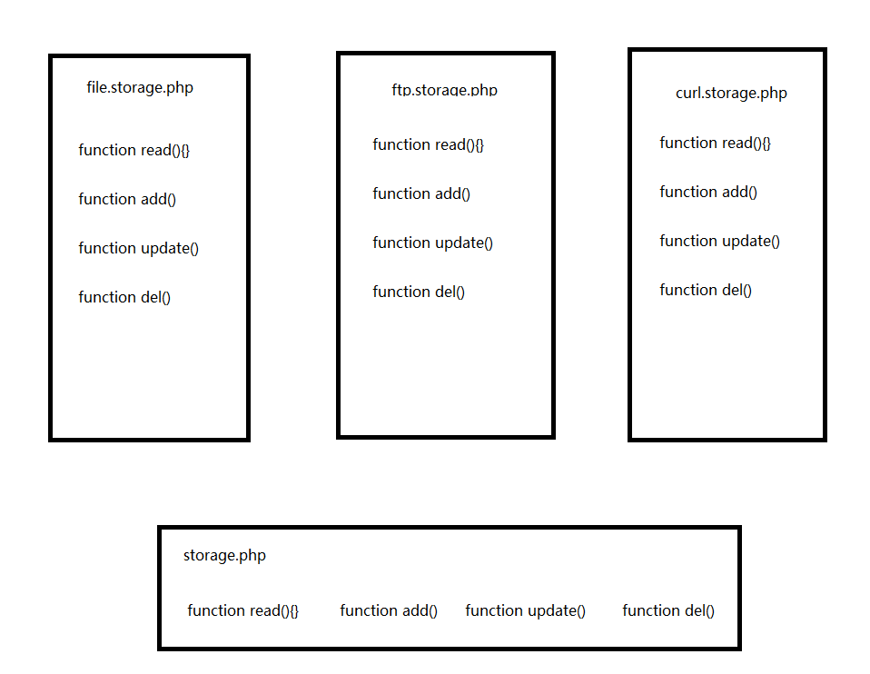

##模块化开发

模块化的概念多见于框架中，而在实际开发中，很少有人会关注模块化问题。特别是用php开发的项目，除了框架中有模块化的概念，能在项目开发中，用心写model类的项目都很少。

在平时的闲聊中，还是会有很多人讨论到模块化的问题。然而他们的对模块化概念的认识，是对核心功能类的友好封装，然后这个类能在不同项目中，良好的使用。这个根本称不上是模块化开发。

###什么是模块化开发

举个例子。

在框架中会有很多的缓存机制，比如，文件式缓存、memcache缓存、redis缓存。

首先框架中会有个配置文件，允许你通过配置完成这三个机制的切换，但同时你又不需要修改代码。原因是框架已经将这三个机制实现的代码进行了统一的封装，在经过配置文件时，返回对应的机制类，在实际的动作时，拥有共同的方法名，这样就实现了模块化开发。

###项目开发中，如何做到模块化开发

举个例子。

正常情况下，用户上传的图片都是存储在本地。但现在系统有一台公用的资源服务器，想要将所有的上传文件，同步到这台服务器上。

有两种方案来实现：一、使用ftp协议传输文件。二、使用curl将文件post到另一台服务器上。

我们现在将问题复杂化一些，需要实现三个需求。第一个将文件存储在本地，第二种，通过ftp将文件传输到另一台服务器，第三种，使用curl将文件post到另一台服务器。

第一步，我们在框架的配置文件中，添加一个配置变量，指定文件存储方式。

第二步，封装三个类，

三个类共同继承storage.php，并且分别实现其中的四个方法。

由storage.php去获取配置文件中的变量，并且指定使用哪种传输方式，返回对应的实现类。