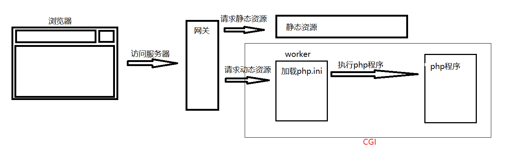

##理解CGI、fastcgi、php-fpm之间的关系

###理解CGI

CGI是公共网关接口，是网站服务器进程经过操作系统和互联网客户端进行通讯的一套规范标准。

通俗的讲CGI就象是一座桥，把网页和WEB服务器中的执行程序连接起来，它把HTML接收的指令传递给服务器的执行程序，如果用户请求的是静态资源，则CGI直接将静态资源返回，如果用户请求的是php程序，则CGI将php程序运行的结果返回给用户。

CGI 的跨平台性能极佳，几乎可以在任何操作系统上实现。

WEB服务器在接收到请求后，执行步骤是：

1. WEB服务器在接收到请求后，如果请求的是静态资源，则返回静态资源。
2. WEB服务器在接收到请求后，如果请求的是动态资源，先要创建cgi的子进程，激活一个CGI进程。
3. 如果是php请求，这个CGI进程就是php解析器。
4. php解析器会去解析php.ini配置文件，初始化执行环境。
5. 然后执行请求的文件，返回处理结果，并退出进程。
6. WEB服务器再将结果返回给浏览器。

以上的3-5的过程就是CGI需要处理的任务。

那么问题来了。服务器没接受到一次动态资源的请求，服务器就要去创建一个CGI进程，加载php配置文件，初始化执行环境。当用户请求量大的时候，会大量挤占系统资源。这就是为什么要出现fastCGI。

###理解fastCGI

fastCGI是CGI的升级版本，FastCGI像是一个常驻(long-live)型的CGI。

那么fastcgi是怎么做的呢？首次，fastcgi会先启一个master，解析配置文件，初始化执行环境，然后再启动多个worker。 当请求过来时，master会传递给一个worker，然后立即可以接受下一个请求。这样就避免了重复的劳动，效率自然是高。而且当worker不够用时，master可以根据配置预先启动几个worker等着；当然空闲worker太多时，也会停掉一些，这样就提高了性能，也节约了资源。这就是fastcgi的对进程的管理。

补充说明：PHP-CGI是PHP自带的FastCGI管理器。

优点：

1. 从稳定性上看，fastCGI是以独立的进程池来运行CGI，单独一个进程死掉，系统可以很轻易的丢弃，然后重新分配新的进程来运行逻辑；
2. 从安全性上看，fastCGI支持分布式运算。fastCGI和宿主的Server完全独立，fastCGI怎么down也不会把Server搞垮；
3. 从性能上看，fastCGI把动态逻辑的处理从Server中分离出来，大负荷的IO处理还是留给宿主Server，这样宿主Server可以一心一意作IO，对于一个普通的动态网页来说, 逻辑处理可能只有一小部分，大量的是图片等静态。

但同样问题来了，因为fastCGI已经事先把php的配置文件加载到执行环境中。那么我们更改了配置文件后，在重启服务器时，就必须把现有的所有worker进程全部杀死，然后重新启动服务。这样服务器就不能平滑重启了，php-fpm就是为了解决这个问题。

###理解php-fpm

PHP-FPM是一个PHP FastCGI管理器。原先，PHP-FPM其实是PHP源代码的一个补丁，旨在将FastCGI进程管理整合进PHP包中。现在我们可以在最新的PHP 5.3.2的源码树里下载得到直接整合了PHP-FPM的分支，据说下个版本会融合进PHP的主分支去。

那么它是怎么做到平滑重启的呢？php-fpm对此的处理机制是新的worker用新的配置，已经存在的worker处理完手上的活就可以歇着了，通过这种机制来平滑过度。

