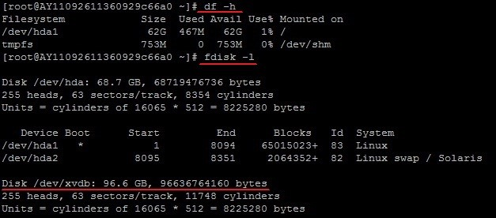
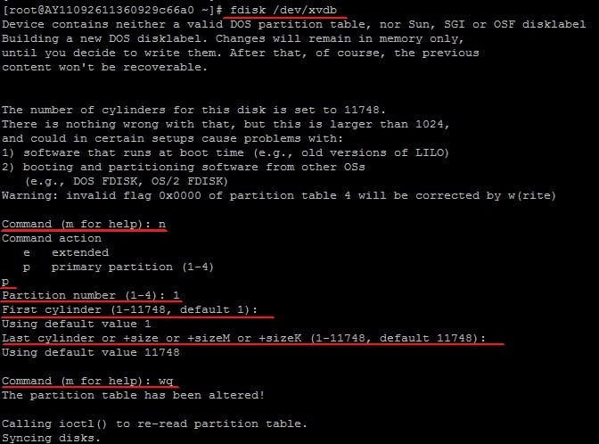
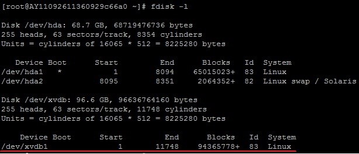
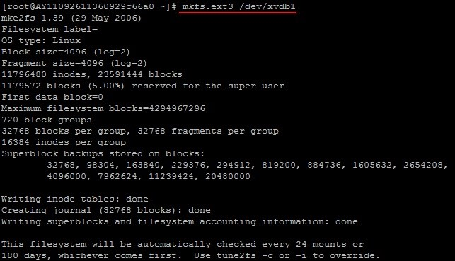

##阿里云ubuntu上挂载磁盘
在阿里云上购买磁盘后，通过管理控制台，将硬盘挂载到对应的服务器后。
###查看磁盘挂载情况

```shell 
//查看当前系统数据盘，但无法查看到挂载盘。
df -h
//查看未挂载的硬盘
fdisk -l
```

###创建分区
```shell
fdisk /dev/xvdb
//然后依次输入
n
	Command (m for help):n
p
	Command action
	e extended
	p primary partition (1-4)
	p
1
	Partition number (1-4): 1
wq
	Command (m for help): w
	The partition table has been altered!
```

###查看新分区
```shell
fdisk -l
```

###格式化分区
```shell
mkfs.ext4 /dev/xvdb1
```

###创建挂载目录并挂载分区
```shell
//创建挂载目录
mkdir /data
//挂载分区
mount /dev/xvdb1 /data
```
###查看挂载情况
```shell
//查看当前系统数据盘，但无法查看到挂载盘。
df -h
```
###设置开机自动挂载
```shell
vim /etc/fstab
//添加以下内容
/dev/xvdb1              /data                   ext3    defaults        0 0
```