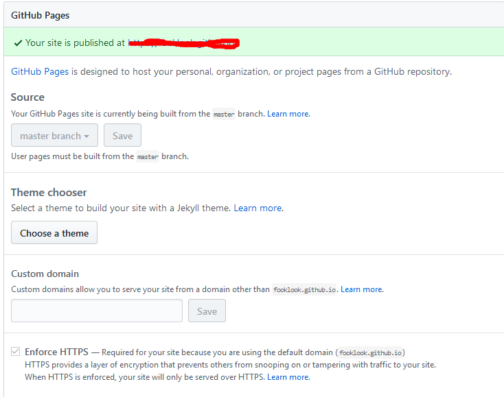

##HEXO+Github搭建博客

###安装环境

首先需要安装git、node.js。

###安装hexo

```
sudo npm install -g hexo
```

###创建hexo项目

```
hexo init projectname
```

###在github上创建项目

因为一个账号对应只能创建一个Pages博客，所以你只能创建yourname.github.io的项目。

###配置hexo

在hexo项目中，有一个配置文件_config.yml。在这个文件最下面，修改配置如下：

```
deploy:
  type: git
  repo: git@github.com:xxxxxxx/yourname.github.io.git
  branch: master
```

###生成静态页面

```
hexo generate(可以缩写成g)
```

###同步hexo静态文件

```
hexo deploy(可以缩写成d)
```

执行以上代码时，如果你已经配置好github的ssh，则会自动同步。

###查看生成的网站

进入github的yourname.github.io项目，->settings->options->GitHub Pages。



看到如上界面，则你的网站已经创建成功，可以通过yourname.github.io访问你的网站了。