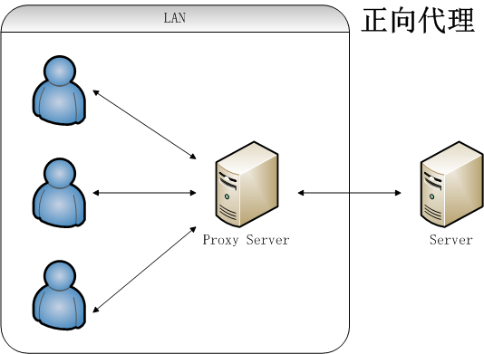

##Nginx反向代理

反向代理（Reverse Proxy）方式是指以代理服务器来接受Internet上的连接请求，然后将请求转发给内部网络上的服务器，并将从服务器上得到的结果返回给Internet上请求连接的客户端，此时代理服务器对外就表现为一个服务器。

###什么是反向代理

反向代理（Reverse Proxy）方式是指以代理服务器来接受Internet上的连接请求，然后将请求转发给内部网络上的服务器，并将从服务器上得到的结果返回给Internet上请求连接的客户端，此时代理服务器对外就表现为一个服务器。

有反向代理，当然也存在正向代理的概念咯。正向代理指的是，一个位于客户端和原始服务器之间的服务器，为了从原始服务器取得内容，客户端向代理发送一个请求并指定目标(原始服务器)，然后代理向原始服务器转交请求并将获得的内容返回给客户端。

我们通过一个简单例子，我们就很好的理解两者之间的区别了。




所以，简单的理解，就是正向代理是为客户端做代理，代替客户端去访问服务器，而反向代理是为服务器做代理，代替服务器接受客户端请求。(感谢@Charles道道 补充)

###为什么使用反向代理

- 可以起到保护网站安全的作用，因为任何来自Internet的请求都必须先经过代理服务器。
- 通过缓存静态资源，加速Web请求。
- 实现负载均衡。顺便说下，目前市面上，主流的负载均衡方案，硬件设备有F5，软件方案有四层负载均衡的LVS，七层负载均衡的Nginx、Haproxy等。

###Nginx反向代理的实战

在生产环境，Tomcat服务器一般不单独使用在项目中，我们一般通过nginx用于反向代理的服务器，并将请求转发给后端多台Tomcat服务器，从而达到负载均衡的目的。

####Nginx的集群配置

在http节点下，添加upstream节点，添加tomcat集群。

```script
upstream tomcats {
    server 127.0.0.1:9001;
    server 127.0.0.1:9002;
}
```

配置location为tomcat集群

```script
location / {
    proxy_pass_header Server;
    proxy_set_header Host $http_host;
    proxy_set_header X-Real-IP $remote_addr;
    proxy_set_header X-Scheme $scheme;
    proxy_pass http://tomcats;
}
```

upstream还可以为每个设备设置状态值，这些状态值的含义分别如下：

- down：表示单前的server暂时不参与负载.
- weight：默认为1.weight越大，负载的权重就越大。
- max_fails：允许请求失败的次数默认为1.当超过最大次数时，返回proxy_next_upstream 模块定义的错误.
- fail_timeout : max_fails次失败后，暂停的时间。
- backup： 其它所有的非backup机器down或者忙的时候，请求backup机器。所以这台机器压力会最轻。

```script
upstream tomcats{
      server 127.0.0.1:9001 down;
      server 127.0.0.1:9002 backup;
      server 127.0.0.1:9003 weight=2;
      server 127.0.0.1:9004 max_fails=2 fail_timeout=60s;   
}
```

####分配策略

#####none（轮询）

upstream按照轮询（默认）方式进行负载，每个请求按时间顺序逐一分配到不同的后端服务器，如果后端服务器down掉，能自动剔除。虽然这种方式简便、成本低廉。但缺点是：可靠性低和负载分配不均衡。

#####weight（权重）

指定轮询几率，weight和访问比率成正比，用于后端服务器性能不均的情况。例如

```script
server 192.168.61.22 weight = 6; # 60% 请求
server 192.168.61.23 weight = 4; # 40% 请求
```

#####ip_hash（访问ip）

每个请求按访问ip的hash结果分配，这样每个访客固定访问一个后端服务器，可以解决session的问题。

配置只需要在upstream中加入ip_hash;即可。

```script
upstream tomcats {
      ip_hash;
      server 127.0.0.1:9001;
      server 127.0.0.1:9002;
}
```

#####fair（第三方）

按后端服务器的响应时间来分配请求，响应时间短的优先分配。与weight分配策略类似。

```script
upstream tomcats {
      server 127.0.0.1:9001;
      server 127.0.0.1:9002;
      fair;
}
```

#####url_hash（第三方）

和IP哈希类似，只不过针对请求的url进行hash（基于缓存的server，页面静态化）。

#####一个模板

```script
upstream tomcats  {
    server ip:8080; 
}

server {
    listen 80;
    server_name  www.lianggzone.com;

    location / {
        proxy_pass  http://tomcats;

        #Proxy Settings
        proxy_redirect     off;
        proxy_set_header   Host             $host;
        proxy_set_header   X-Real-IP        $remote_addr;
        proxy_set_header   X-Forwarded-For  $proxy_add_x_forwarded_for;
        proxy_next_upstream error timeout invalid_header http_500 http_502 http_503 http_504;
        proxy_max_temp_file_size 0;
        proxy_connect_timeout      90;
        proxy_send_timeout         90;
        proxy_read_timeout         90;
        proxy_buffer_size          4k;
        proxy_buffers              4 32k;
        proxy_busy_buffers_size    64k;
        proxy_temp_file_write_size 64k;
   }
}
```

#####反向代理实战

现在，我们开始一个完整的配置，配置如下

```script
upstream tomcats {
    server 127.0.0.1:9001;
    server 127.0.0.1:9002;
}

server {
    listen 80;
    server_name  www.lianggzone.com;
    location / {
        proxy_pass_header Server;
        proxy_set_header Host $http_host;
        proxy_set_header X-Real-IP $remote_addr;
        proxy_set_header X-Scheme $scheme;
        proxy_pass http://tomcats;
    }
}
```