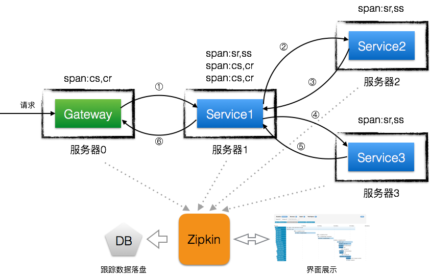

##zipkin分布式跟踪系统概念

###大型互联网公司为什么需要分布式跟踪系统

为了支撑日益增长的庞大业务量，我们会把服务进行整合、拆分，使我们的服务不仅能通过集群部署抵挡流量的冲击，又能根据业务在其上进行灵活的扩展。一次请求少则经过三四次服务调用完成，多则跨越几十个甚至是上百个服务节点。如何动态展示服务的链路？如何分析服务链路的瓶颈并对其进行调优？如何快速进行服务链路的故障发现？这就是服务跟踪系统存在的目的和意义。

###分布式系统设计要点

第一点：对应用透明、低侵入

分布式系统之间的通讯靠的都是RPC、MQ等中间件系统，即使是内部使用的线程池或者数据库连接池，大多也是使用经过公司包装公共库，这就给服务跟踪带来了机会，我只要对中间件和公共库进行改造，就几乎可以做到全方位跟踪，当然，这也是有难度的。

第二点：低开销、高稳定

大多数应用不愿意接入监控系统的原因是怕影响线上服务器的性能，特别是那些对性能特别敏感的应用，所以，分布式跟踪系统一定要轻量级，不能有太复杂的逻辑和外部依赖，甚至需要做到根据服务的流量来动态调整采集密度。

第三点：可扩展

随着接入的分布式系统的增多，压力也将不断增长，分布式跟踪系统是否能动态的扩展来支撑不断接入的业务系统，这也是设计时需要考虑的。

###数据模型



如上图所示，在分步式服务器都会想zipkin服务器发送一个跟踪数据，而这个跟踪数据称为span。

span直译过来是"跨度"，在谷歌的Dapper论文中表示跟踪树中树节点引用的数据结构体，span是跟踪系统中的基本数据单元。

在Zipkin中，每个span中一般包含如下字段：

traceId：全局跟踪ID，用它来标记一次完整服务调用，所以和一次服务调用相关的span中的traceId都是相同的，Zipkin将具有相同traceId的span组装成跟踪树来直观的将调用链路图展现在我们面前。

id：span的id，理论上来说，span的id只要做到一个traceId下唯一就可以，比如说阿里的鹰眼系统巧妙用span的id来体现调用层次关系（例如0，0.1，0.2，0.1.1等），但Zipkin中的span的id则没有什么实际含义。

parentId：父span的id，调用有层级关系，所以span作为调用节点的存储结构，也有层级关系，就像图3所示，跟踪链是采用跟踪树的形式来展现的，树的根节点就是调用调用的顶点，从开发者的角度来说，顶级span是从接入了Zipkin的应用中最先接触到服务调用的应用中采集的。所以，顶级span是没有parentId字段的，拿图2所展现的例子来说，顶级span由Gateway来采集，Service1的span是它的子span，而Service2和Service3的span是Service1的span的子span，很显然Service2和Service3的span是平级关系。

name：span的名称，主要用于在界面上展示，一般是接口方法名，name的作用是让人知道它是哪里采集的span，不然某个span耗时高我都不知道是哪个服务节点耗时高。

timestamp：span创建时的时间戳，用来记录采集的时刻。

duration：持续时间，即span的创建到span完成最终的采集所经历的时间，除去span自己逻辑处理的时间，该时间段可以理解成对于该跟踪埋点来说服务调用的总耗时。

annotations：基本标注列表，一个标注可以理解成span生命周期中重要时刻的数据快照，比如一个标注中一般包含发生时刻（timestamp）、事件类型（value）、端点（endpoint）等信息，这里给出一个标注的json结构：

```json
{
    "timestamp": 1476197069680000,
    "value": "cs",
    "endpoint": {
        "serviceName": "service1",
        "ipv4": "xxx.xxx.xxx.111"
    }
}
```

那么，有哪些事件类型呢？答案是四种：cs（客户端/消费者发起请求）、cr（客户端/消费者接收到应答）、sr（服务端/生产者接收到请求）和ss（服务端/生产者发送应答）。可以看出，这四种事件类型的统计都应该是Zipkin提供客户端来做的，因为这些事件和业务无关，这也是为什么跟踪数据的采集适合放到中间件或者公共库来做的原因。

binaryAnnotations：业务标注列表，如果某些跟踪埋点需要带上部分业务数据（比如url地址、返回码和异常信息等），可以将需要的数据以键值对的形式放入到这个字段中。


