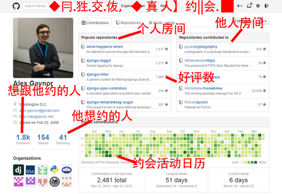
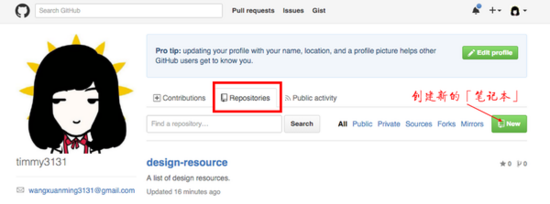
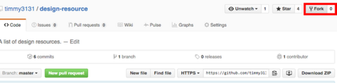
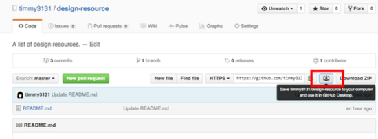
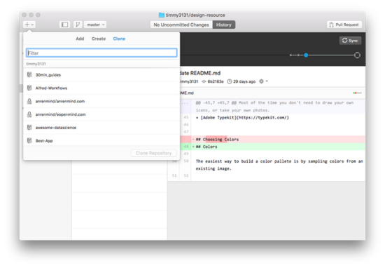
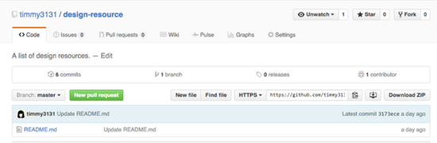
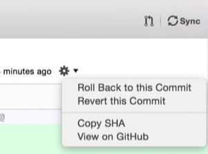
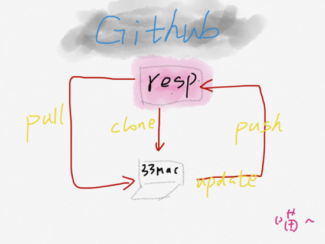

##妹子告诉你怎样使用 GitHub！

###什么是 Github ？必须要放这张图了！！！ 



Git 是由 Linux 之父 Linus Tovalds 为了更好地管理linux内核开发而创立的分布式版本控制／软件配置管理软件。

好吧，我相信看到这里你已经晕了，这也是我一开始看那些所谓经典教程的感受。写这些教程的人都是几年以上的程序员呀，他们往往直接就告诉你所有命令的含义或者整个体系。

专家盲点（expert blind spot）就是对一个事物知道的越多，就越发不记得“不知道这个事”的情形。

简单来说，Git 是一个管理你的「代码的历史记录」的工具。 

我不是程序员为什么要学这个啊啊啊！又不要管理代码们！

别急，虽然 github 学习门槛高，一会你就知道为什么人人都应该会这个啦！ 

###学习步骤

####注册安装

去官网注册一个账号。

然后，下载一个 [https://desktop.github.com/](GitHub Desktop) mac客户端是最方便的啦！（命令行什么的真的是会越来越晕！先别管他们！） 

假设33（珊姗就是我啦）、小四和你三个人一起写一本小说（澄清一下，并没有黑任何人的意思，恩！），暂且叫做…《梦里花落爱吃土时代》

(⊙v⊙)嗯！终于可以正式开始了！

####创建新项目

我们三个人在不同的城市要远程共同写一本书，要有一个漂亮的笔记本吧？



repositories 就是你的笔记本们。你只需知道 Repository 是个放项目的地方就行。有时候会出现 Repositories ，是多个 Repository 的意思。 

####fork

如果你不想新建一个笔记本，看到小四之前写过一个好到炸裂的文章，想把他的直接全部偷过来，修改修改就成你自己的文章了，这应该怎么办呢？

github 还提供了一个很赞的功能叫做 fork ，你只需要点击这个神奇的按钮，就可以把他的「笔记本」变成你自己的啦！任意修改都可以哦~ 



####把「笔记本」克隆到本地 

「笔记本」在云端，你要把它摘下来放到自己的电脑上写小说才方便呀，在这里我们叫 clone 是不是很形象？步骤如图：或者是直接去我们的客户端 



或者是直接去我们的客户端



####可以开始写作啦！

你的笔记本里已经自动有一个文档了，这个时候让我们回到网页版[微笑脸]

你只需要在 web 端点开这个README.md可以开始在里面写你的小说了。或者直接点开刚刚 clone 到电脑上的文件夹直接在里面写。



或者直接点开刚刚 clone 到电脑上的文件夹直接在里面写。

ps:需要注意的是，文本支持 markdown 格式，可以先参考这个 [献给写作者的 Markdown 新手指南](http://www.jianshu.com/p/q81RER) 。 

####上传你写的小说 

在本地写完之后你要上传到云端让我和小四都能看见你写出什么幺蛾子了吧？

回到客户端，你发现有变化！！！没错，在你头像旁边给你这次提交内容起一个名字，以后如果再次寻找的时候会很方便。然后点下面的 Commit to master ，还有右上角的 Sync 就好啦！


没错，在你头像旁边给你这次提交内容起一个名字，以后如果再次寻找的时候会很方便。然后点下面的 Commit to master ，还有右上角的 Sync 就好啦！

####回退到之前的版本 

夜深人静的时候，我趁着你们都在睡觉把小说的结局偷偷地改成女主死掉了！

你醒来觉得我这结局改的也太悲伤了，完全不能接受！结局必须要和之前那样王子公主幸福的生活在一起的 happy ending！

问题又来了，怎么退回到我修改结局之前的 happy ending？

还是刚刚那个客户端，选择 History 然后点击小齿轮，选择潇洒地点 roll back to this commit！

你又回到happy ending的状态啦！！



####获取服务器上版本

小四写了一章华丽无比的番外，你要更新本地的小说和他写的保持一致怎么办？

```shell
git pull
```

好了，知道这些基本操作入门应该够了，我们来回顾一下（不要嫌弃我的画工啊喂！）



【内容来之知乎】