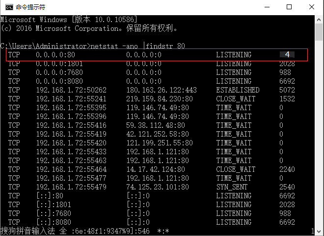
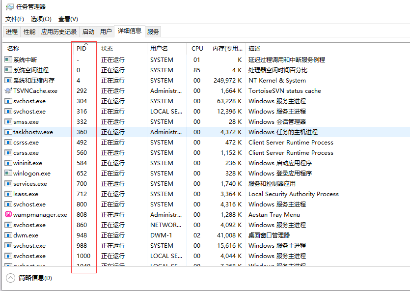

##系统升级win10后解除80端口被占用的情况

###找到是什么占用了80端口

通过cmd查找

```shell
netstat -ano |findstr 80
```





通过以上两步，可以确定是一个系统进程占用了端口。如果是普通的进程，可以直接关闭。但是如果像这种是系统进程，那就比较麻烦了。

详细解除占用的方法可以参考此[链接](http://jingyan.baidu.com/article/7e4409533ffe092fc1e2ef10.html)。