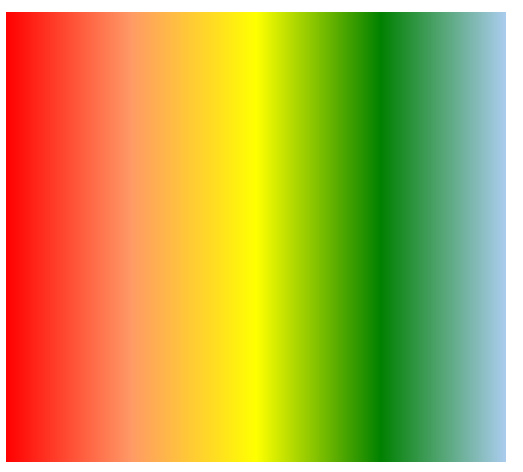

##css3渐变

###线性渐变

####不同浏览器兼容问题

```html
//正常浏览器使用方法
background:-moz-linear-gradient([<point> || <angle>]+,<stop>, <stop> [, <stop>]*);
background:-webkit-linear-gradient([<point> || <angle>]+,<stop>, <stop> [, <stop>]*);
background:-o-linear-gradient([<point> || <angle>]+,<stop>, <stop> [, <stop>]*);

//IE依靠滤镜实现渐变。startColorstr表示起点的颜色，endColorstr表示终点颜色。GradientType表示渐变类型，0为缺省值，表示垂直渐变，1表示水平渐变。
filter: progid:DXImageTransform.Microsoft.gradient(GradientType=0, startColorstr=#1471da, endColorstr=#1C85FB);/*IE<9>*/
-ms-filter: "progid:DXImageTransform.Microsoft.gradient (GradientType=0, startColorstr=#1471da, endColorstr=#1C85FB)";/*IE8+*/
```

####按point来指定渐变方向

```html
//从左向右渐变
background:-moz-linear-gradient(left,#000,#fff);
//从左上角向右下角渐变
background:-moz-linear-gradient(left top,#000,#fff);
```

####按angle（角度）指定渐变方向

```html
//从左向右渐变
background:-moz-linear-gradient(0deg,#000,#fff);
//从左下角向右上角渐变
background:-moz-linear-gradient(45deg,#000,#fff);
```

####指定渐变宽度

```html
//从左向右20%，80%进行渐变
background:-moz-linear-gradient(left,#000,20%,#fff);
//从左向右80%，20%进行渐变
background:-moz-linear-gradient(left,#000,80%,#fff);
```

####透明色+背景图片渐变

```html
background:-moz-linear-gradient(45deg,rgba(0,0,0,0),90%, rgba(255,0,255,1)),url(./001.jpg);
```

####代码示例

```html
<style type="text/css">
    .line-box{
        width:500px;
        height: 450px;
        background: -webkit-linear-gradient(left, red, #f96, yellow, green, #ace);
        background: -o-linear-gradient(left, red, #f96, yellow, green, #ace);
        background: linear-gradient(to right, red, #f96, yellow, green, #ace);
    }	
</style>
<div class="line-box"></div>
```



###经向渐变

IE10+等浏览器支持径向渐变，opera浏览器不支持。

####不同浏览器写法

```html
-moz-radial-gradient([<bg-position> || <angle>]?, [<shape> || <size>]?, <color-stop>, <color-stop>[, <color-stop>]*); /* Firefox 3.6 - 15 */
-webkit-radial-gradient([<bg-position> || <angle>]?, [<shape> || <size>]?, <color-stop>, <color-stop>[, <color-stop>]*); /* Safari 5.1 - 6.0 */
-o-radial-gradient([<bg-position> || <angle>]?, [<shape> || <size>]?, <color-stop>, <color-stop>[, <color-stop>]*); /* Opera 11.6 - 12.0 */
radial-gradient([<bg-position> || <angle>]?, [<shape> || <size>]?, <color-stop>, <color-stop>[, <color-stop>]*); /* 标准的语法 */
```

####普通使用方法

```html
background: radial-gradient(#ace, #f96, #1E90FF);
background: -moz-radial-gradient(#ace, #f96, #1E90FF);
background: -webkit-radial-gradient(#ace, #f96, #1E90FF);
```

####比例显示

```html
background: radial-gradient(#ace 5%, #f96 25%, #1E90FF 50%);
background: -moz-radial-gradient(#ace 5%, #f96 25%, #1E90FF 50%);
background: -webkit-radial-gradient(#ace 5%, #f96 25%, #1E90FF 50%);
```

####通过position设置圆心位置

```html
background: radial-gradient(bottom left, #ace, #f96, #1E90FF);
background: -moz-radial-gradient(bottom left, #ace, #f96, #1E90FF);
background: -webkit-radial-gradient(bottom left, #ace, #f96, #1E90FF);
```

####size:

- closest-side：指定径向渐变的半径长度为从圆心到离圆心最近的边
- closest-corner：指定径向渐变的半径长度为从圆心到离圆心最近的角
- farthest-side：指定径向渐变的半径长度为从圆心到离圆心最远的边
- farthest-corner：指定径向渐变的半径长度为从圆心到离圆心最远的角
- contain：包含，指定径向渐变的半径长度为从圆心到离圆心最近的点。类同于closest-side
- cover：覆盖，指定径向渐变的半径长度为从圆心到离圆心最远的点。类同于farthest-corner 

####shape

- circle：指定圆形的径向渐变
- ellipse：指定椭圆形的径向渐变。写本文档时Chrome,Safari尚不支持该参数值

####设置一个椭圆型渐变

```html
.radial-box{
    width:500px;
    height: 450px;
    /*border-radius: 100%;*/
    background: radial-gradient(150px 100px at 100px  150px,#f96,#000,yellow,rgba(0,255,0,0.5),rgba(0,105,0,0.5),rgba(255,0,255,0.5));
    background: -webkit-radial-gradient(150px 1000px at 100px  150px,#f96,#000,yellow,rgba(0,255,0,0.5),rgba(0,105,0,0.5),rgba(255,0,255,0.5));
}
```

第一个参数的前两个数值，分别指定主要半径，次要半径。后面两个数值指定圆心的位置。

后面指定的色值除最后一个做为整个盒子的背景色外，其它不管设置多少个色值都为椭圆的渐进色。

####其它方式设置椭圆型渐变

```html
//普通使用方法
background:radial-gradient(ellipse,#f96,green);
background:-webkit-radial-gradient(ellipse,#f96,green);
//指定size
background:radial-gradient(ellipse closest-corner,#f96,green);
background:-webkit-radial-gradient(ellipse closest-corner,#f96,green);
```

###重复渐变

####线性重复渐变

```html
background: repeating-linear-gradient(45deg , red, yellow 100px, green 200px);
background: -moz-repeating-linear-gradient(45deg , red, yellow 100px, green 200px);
background: -webkit-repeating-linear-gradient(45deg , red, yellow 100px, green 200px);
```

####径向重复渐变
```html
background: repeating-radial-gradient(100px 200px, #ace, #ace 5px, #f96 5px, #f96 10px);
background: -moz-repeating-radial-gradient(100px 200px, #ace, #ace 5px, #f96 5px, #f96 10px);
background: -webkit-repeating-radial-gradient(100px 200px, #ace, #ace 5px, #f96 5px, #f96 10px);
```
